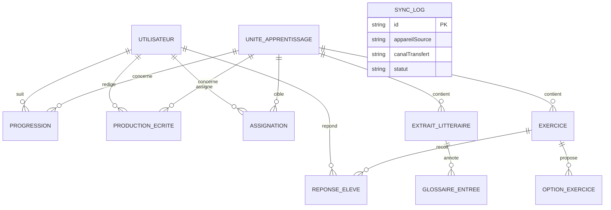

# Schéma de données Room — Liteschreib IKII

Ce document précise le modèle de données attendu pour la Mission A4 (`04-missions-et-sprints.md`). Il doit être mis à jour à chaque évolution de schéma, en parallèle des migrations Room réelles.

## 1. Diagramme relationnel (vue d'ensemble)

*(`SYNC_LOG` reste isolée du reste du modèle métier — table technique, cohérent avec ADR-004.)*

## 2. Entités détaillées (Schéma réel — 11 entités)

### Utilisateur (UtilisateurEntity)
Unifie les profils élève et enseignant (ADR-016).

| Champ | Type | Description |
|---|---|---|
| `id` (PK) | Long | Identifiant unique |
| `nomAffiche` | String | Nom de l'utilisateur |
| `role` | String | `ELEVE` | `ENSEIGNANT` |
| `classe` | String? | Nom de la classe (ex. "3ème A") — uniquement pour le rôle ELEVE |
| `niveau` | String? | Niveau GeR (ex. "A1") — uniquement pour le rôle ELEVE |
| `codeAcces` | String? | PIN optionnel |

### UniteApprentissage
Correspond à une ligne validée de `09-cartographie-contenu-pedagogique.md`.

| Champ | Type | Description |
|---|---|---|
| `id` (PK) | String | Identique à l'ID Unité de la cartographie (ex. `U-001`) |
| `niveauGer` | String | Niveau GeR ciblé |
| `chapitreCurriculum` | String | Référence au chapitre *Ihr und Wir Plus* |
| `titre` | String | Titre de l'unité |
| `objectifsApprentissage` | String | Texte libre ou liste sérialisée |
| `ordreAffichage` | Int | Ordre de présentation dans le parcours |
| `isValidated` | Boolean | État de validation pédagogique (ADR-015) |

### ExtraitLitteraire
| Champ | Type | Description |
|---|---|---|
| `id` (PK) | String | Identifiant de l'extrait |
| `uniteId` | String | Unité associée (FK → UniteApprentissage) |
| `texteAllemand` | String | Contenu de l'extrait |
| `auteur` | String? | Auteur de l'œuvre |
| `source` | String? | Référence bibliographique |
| `statutDroits` | String | `domaine_public` / `autorisation_obtenue` / `texte_original` |

### GlossaireEntree
| Champ | Type | Description |
|---|---|---|
| `id` (PK) | String | Identifiant |
| `extraitId` | String | Extrait associé (FK → ExtraitLitteraire) |
| `motAllemand` | String | Mot ou expression surligné |
| `traductionFr` | String | Traduction/définition en français |

### Exercice
| Champ | Type | Description |
|---|---|---|
| `id` (PK) | String | Identifiant |
| `uniteId` | String | Unité associée (FK → UniteApprentissage) |
| `type` | String | `QCM`, `TEXTE_A_TROUS`, `VRAI_FAUX`, `PRODUCTION_GUIDEE` |
| `enonce` | String | Consigne |
| `correctionAttendue` | String? | Réponse attendue |

### OptionExercice
| Champ | Type | Description |
|---|---|---|
| `id` (PK) | String | Identifiant |
| `exerciceId` | String | Exercice associé (FK → Exercice) |
| `texteOption` | String | Texte de l'option |
| `estCorrecte` | Boolean | Vrai si c'est la bonne réponse |

### ReponseEleve
| Champ | Type | Description |
|---|---|---|
| `id` (PK) | String | Identifiant |
| `eleveId` | Long | Élève ayant répondu (FK → Utilisateur) |
| `exerciceId` | String | Exercice concerné (FK → Exercice) |
| `reponseDonnee` | String | Réponse fournie |
| `estCorrecte` | Boolean | Résultat de la correction offline |
| `dateReponse` | Long | Date de la réponse |

### ProductionEcrite
| Champ | Type | Description |
|---|---|---|
| `id` (PK) | String | Identifiant unique |
| `eleveId` | Long | Auteur (FK → Utilisateur) |
| `uniteId` | String | Unité liée (FK → UniteApprentissage) |
| `contenuTexte` | String | Texte rédigé |
| `dateCreation` | Long | Date de création |
| `dateModification` | Long | Dernière modification |
| `autoEvaluationJson` | String? | Résultat de la grille d'auto-évaluation |
| `statut` | String | `BROUILLON` | `SOUMIS` (ADR-017, correctif B-21) |

### Progression
| Champ | Type | Description |
|---|---|---|
| `id` (PK) | String | Identifiant |
| `eleveId` | Long | Élève concerné (FK → Utilisateur) |
| `uniteId` | String | Unité concernée (FK → UniteApprentissage) |
| `statut` | String | `NON_COMMENCE`, `EN_COURS`, `TERMINE` |
| `scoreMoyen` | Float? | Score moyen aux exercices de l'unité |
| `dateMiseAJour` | Long | Dernière mise à jour |

### Assignation
| Champ | Type | Description |
|---|---|---|
| `id` (PK) | String | Identifiant unique (UUID) |
| `enseignantId` | Long | ID de l'enseignant (FK → Utilisateur) |
| `cibleType` | String | `ELEVE` | `CLASSE` |
| `cibleId` | String | ID élève (String) ou nom de classe |
| `uniteId` | String | Unité assignée (FK → UniteApprentissage) |
| `dateAssignation` | Long | Timestamp de l'assignation (FR-26) |

### SyncLog (table technique)
| Champ | Type | Description |
|---|---|---|
| `id` (PK) | String | Identifiant |
| `appareilSource` | String | Identifiant local de l'appareil source |
| `appareilCible` | String? | Identifiant de l'appareil cible |
| `canalTransfert` | String | `NEARBY_SHARE`, `BLUETOOTH`, `FICHIER_MANUEL` |
| `versionFichierEchange` | String | Numéro de version du format d'échange |
| `dateSync` | Long | Date de synchronisation |
| `statut` | String | `SUCCES`, `ECHEC`, `PARTIEL` |
| `resumePayload` | String? | Résumé de ce qui a été transféré |

## 2-bis. Modèle initialement envisagé, non retenu — voir ADR-016

Cette section conserve les entités relationnelles initialement prévues pour assurer la traçabilité.

### ProfilEleve (obsolète)
Remplacé par `UtilisateurEntity`. Prévoyait : `nom`, `classeId`, `niveauGerCourant`, `avatarRef`, `codeAcces`.

### ProfilEnseignant (obsolète)
Remplacé par `UtilisateurEntity`. Prévoyait : `nom`, `etablissement`.

### Classe (obsolète)
Remplacé par le champ `classe` (String) dans `UtilisateurEntity`. Prévoyait une entité relationnelle propre.

### PlanificationRevision (en attente)
Prévue pour le Sprint 7 (ADR-003).

## 3. Stratégie de pré-population

- Le contenu (`UniteApprentissage`, `ExtraitLitteraire`, `GlossaireEntree`, `Exercice`, `OptionExercice`) est fourni sous forme de fichiers **JSON en assets**, générés à partir de la cartographie validée (`09-cartographie-contenu-pedagogique.md`).
- Au premier lancement, un `RoomDatabase.Callback.onCreate()` charge ces JSON et peuple la base — **aucun réseau requis**.

## 4. Stratégie de migration

- Chaque évolution de schéma incrémente la version de la base.
- Une migration explicite est écrite et testée avant tout merge modifiant une entité existante.
- **Migration 4→5** : ajout table `assignation`, ajout colonne `statut` sur `production_ecrite` — voir ADR-017.

## 5. Points ouverts restants

- Format exact de sérialisation de `etatAlgorithme` (Répétition espacée, Sprint 7).
