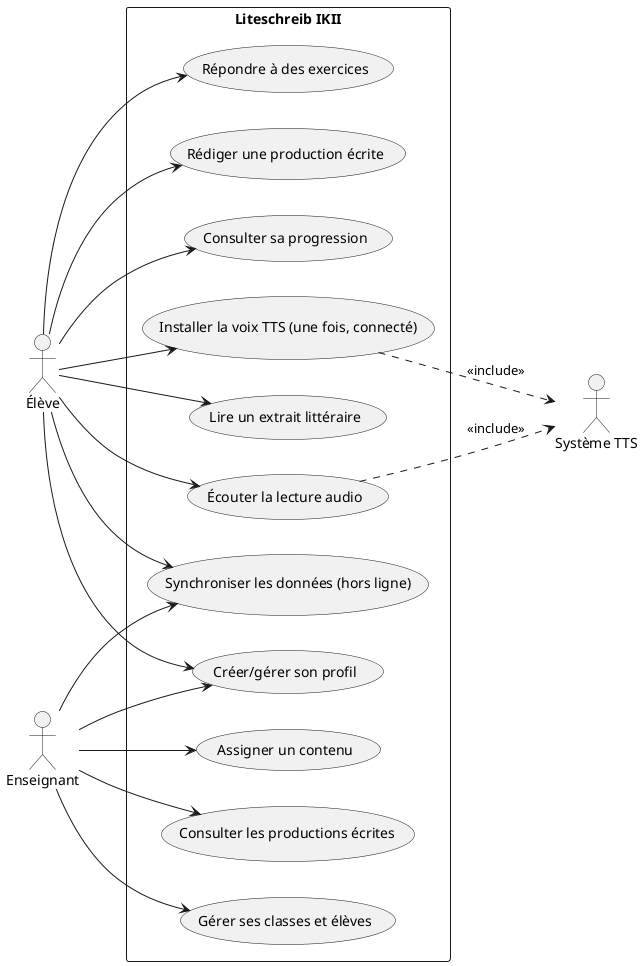
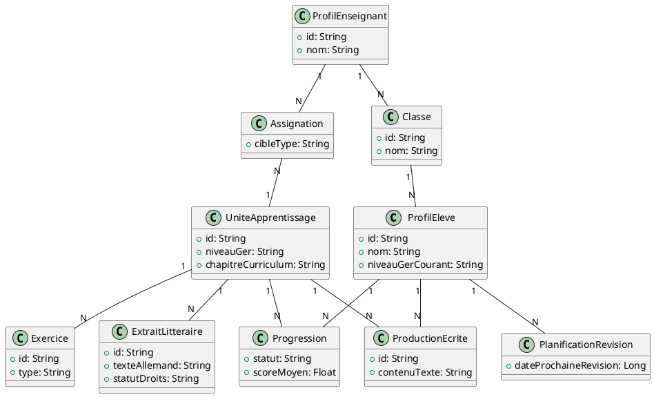
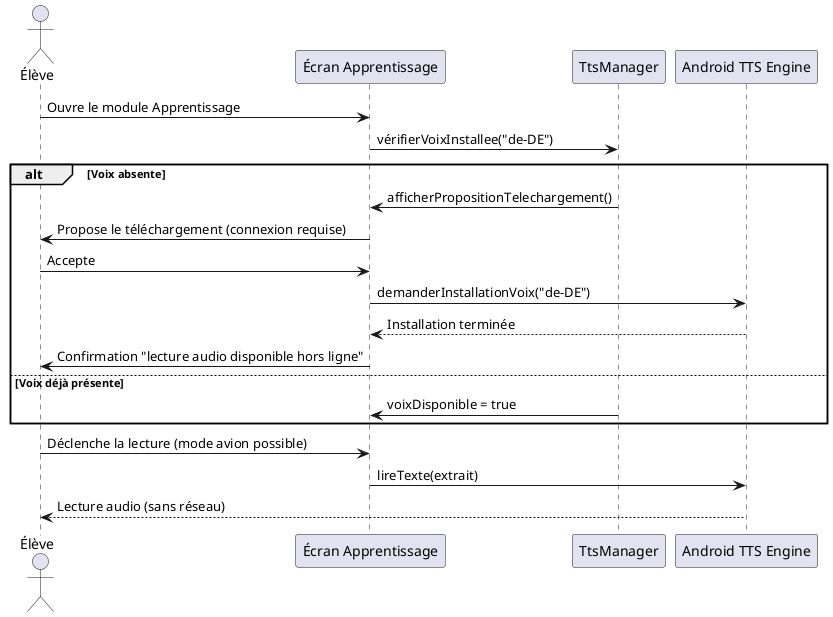
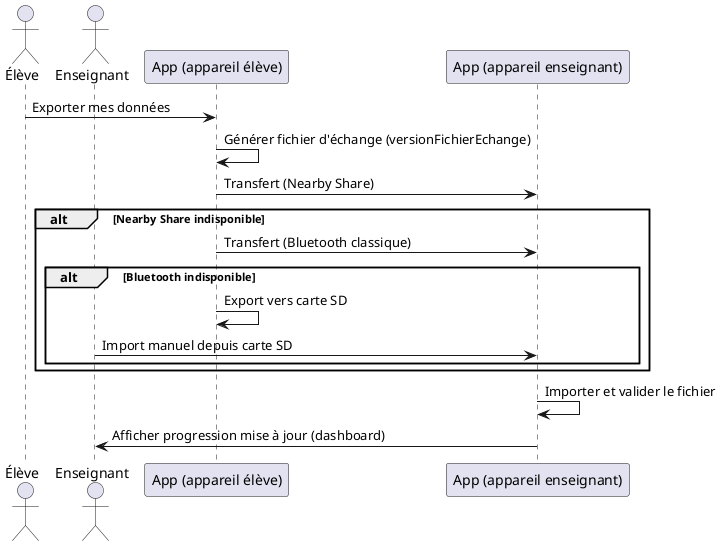

# Diagrammes UML — Liteschreib IKII

Ce document formalise et versionne les diagrammes UML du projet, jusqu'ici réalisés en conception mais non committés dans `/docs`. Le code source PlantUML est directement exploitable avec le plugin PlantUML d'Android Studio déjà utilisé sur le projet, et sert également d'annexe pour le mémoire.

## 1. Diagramme de cas d'usage (vue d'ensemble)

## 2. Diagramme de classes — modèle de domaine simplifié

Reflète le schéma détaillé dans `11-schema-donnees-room.md`, en se limitant aux entités et relations principales (les DTO/Entity Room techniques ne sont pas représentés ici, seule la vue domaine).

## 3. Diagramme de séquence — Installation de la voix TTS (ADR-007)

## 4. Diagramme de séquence — Synchronisation locale enseignant-élève (ADR-004)

## 5. Statut et gouvernance

| Diagramme | Statut | Dernière mise à jour liée à |
|---|---|---|
| Cas d'usage global | Formalisé | Décisions ADR-004, ADR-007, ADR-009 |
| Classes — domaine | Formalisé (simplifié) | `11-schema-donnees-room.md` |
| Séquence — TTS | Formalisé | ADR-007 |
| Séquence — Synchronisation | Formalisé | ADR-004 |

Tout changement structurel du domaine (nouvelle entité, nouveau flux) doit être répercuté dans ce document en même temps que dans `06-architecture-technique.md` et `11-schema-donnees-room.md`, pour éviter une dérive entre la documentation et le code.
