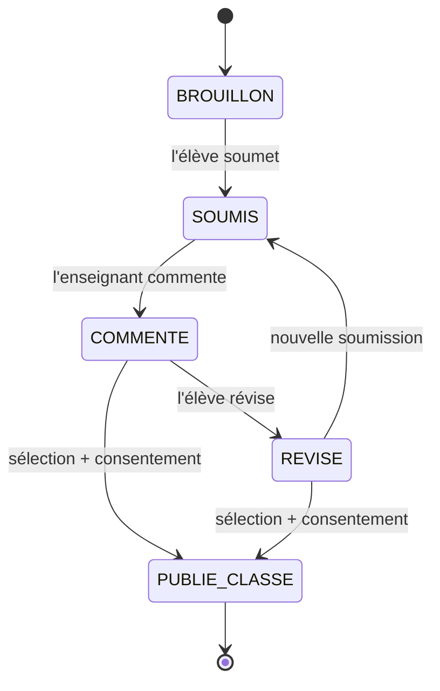
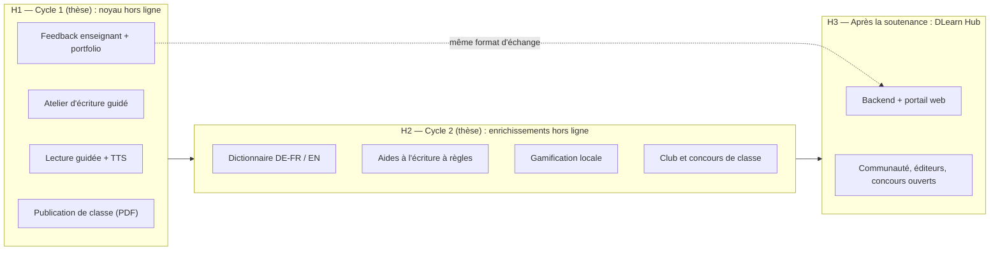

# Vision produit et horizons — Liteschreib IKII

> **Statut :** Accepté (ADR-020) — 2026-09-21
> **Source :** proposition de fonctionnalités `DLearn-New-Fonctionnalités.md` (plateforme de promotion de la littérature allemande) et analyse d'impact de l'Architecte du 2026-09-21.
> **Nature du document :** référentiel de classement. Il ne décrit aucune implémentation ; il dit **quoi, dans quel horizon, et sous quelles conditions**. Les exigences détaillées vivent dans `01-exigences-fonctionnelles.md` (FR-35 à FR-46) et les décisions structurantes dans `06-architecture-technique.md` (ADR-020 à ADR-025).

## 1. Pourquoi ce document

La proposition d'origine mêle deux produits sous un même nom :

| | Produit A — Outil pédagogique DaF | Produit B — Plateforme sociale et éditoriale |
|---|---|---|
| Public | Élèves du collège (6e–3e) et leurs enseignants | Élèves, étudiants, auteurs, éditeurs, lecteurs, passionnés |
| Connectivité | Hors ligne strict (ADR-002) | En ligne (comptes globaux, contenus partagés) |
| Données | Locales, appareil de l'élève | Serveur, modération, droits, protection des mineurs |
| Lien avec la thèse (DBR) | Direct : compétence écrite par la littérature | Périphérique |
| Charge | Compatible avec un développeur unique sur 12 mois | Équipe, hébergement, maintenance après la thèse |

Le **produit A est le périmètre de la thèse**. Le **produit B** est une perspective (horizon H3) dont on préserve la possibilité sans la construire.

## 2. Les 12 capacités de la proposition (dédupliquées)

Le document d'origine répète les mêmes idées à cinq endroits (l'atelier d'écriture apparaît quatre fois, la gamification trois fois, l'IA quatre fois). Regroupées, elles forment 12 capacités.

| ID | Capacité | Éléments de la proposition regroupés |
|---|---|---|
| C1 | Bibliothèque et lecture guidée | Bibliothèque numérique, textes par classe et thème, suggestions selon l'âge, résumés, bibliothèque d'inspiration (citations, poèmes, contes africains), espace jeunesse |
| C2 | Atelier d'écriture guidé | Exercices et défis d'écriture, cours d'écriture, méthodologie des types de rédaction (dialogue, description, argumentation, lettre, e-mail, publicité, discours), structure idée–argument–exemple, rédaction fonctionnelle (lettres formelles/informelles), construction d'un roman, personnages |
| C3 | Aides à l'écriture | Dictionnaire multilingue, correcteur orthographe/grammaire, synonymes, générateur d'idées, coach IA, détection de textes générés par IA |
| C4 | Feedback, évaluation, portfolio | Feedback et évaluation des parcours, portfolio d'écriture, commentaires enseignants, aide à la révision |
| C5 | Suivi et gamification | Progression, temps d'écriture, objectifs quotidiens, points, niveaux, badges, classement, certificats |
| C6 | Ressources et préparation de cours (enseignant) | Fiches de lecture, évaluations, dictées, séquences pédagogiques, progressions annuelles, partage de cours |
| C7 | Club de lecture et animation | Club de lecture, défis de lecture mensuels, quiz littéraires, recommandations |
| C8 | Concours | Concours de nouvelles/poésie/contes, concours scolaires, prix, annonces de concours locaux et internationaux |
| C9 | Publication et critique | Publier ses textes, commenter, noter, suivre des auteurs, critique littéraire |
| C10 | Espace éditeurs et « du manuscrit à la publication » | Catalogues, appels à textes, dépôt de manuscrits, suivi de candidature, formations, webinaires, illustrateurs |
| C11 | Direct et échanges | Classes virtuelles, débats en direct, padlet, échanges avec des écrivains débutants d'autres pays, ateliers avec des écrivains, forum, communauté |
| C12 | Audio | Livres audio, podcasts, enregistrement de ses propres lectures, lecture TTS |

## 3. Critères de classement

| ID | Critère | Question posée |
|---|---|---|
| K1 | Hors ligne | Fonctionne-t-elle sans connexion, sans donnée qui quitte l'appareil (ADR-002, NFR-01, NFR-09) ? |
| K2 | Alignement DBR | Renforce-t-elle la question de recherche (compétence écrite par la littérature, processus brouillon → feedback → révision) ? |
| K3 | Niveau | Est-elle réaliste pour des élèves de 6e à 3e, en A1–A2 (ADR-008) ? |
| K4 | Contenu validé | Quelle charge de contenu à valider par un humain ajoute-t-elle (R-07) ? |
| K5 | Droits, données, mineurs | Quels risques de droits d'auteur, de licence (ADR-006, ADR-025) et de protection des mineurs ? |
| K6 | Coût solo | Est-elle réalisable par un développeur seul sans dégrader le calendrier (R-06, R-13) ? |

## 4. Définition des horizons

| Horizon | Périmètre | Condition d'entrée |
|---|---|---|
| **H1** | Cycle DBR 1 (thèse) : noyau pédagogique hors ligne | K1, K2 et K3 satisfaits, coût maîtrisé |
| **H2** | Cycle DBR 2 (thèse) : enrichissements hors ligne | K1 satisfait ; K4 et K6 compatibles avec la capacité restante après H1 |
| **H3** | Après la soutenance : « DLearn Hub » (backend + portail web) | Nécessite un nouvel ADR superséant ADR-002, un protocole éthique refait, un hébergement et un plan de maintenance |
| **Écarté** | Ne sera pas réalisé en l'état | Voir §6 |

## 5. Classement des capacities

| Capacité | Horizon | Forme retenue | Écarté ou reporté | Dépendances |
|---|---|---|---|---|
| **C1** Bibliothèque et lecture guidée | H1 (existant) puis H2 (extension) | Lectures par niveau et thème ; extraits du domaine public et textes originaux ; résumés originaux | Livres sous droits, catalogues d'éditeurs, auteurs contemporains sans autorisation | A0, ADR-025, ADR-028, Mission F1c |
| **C2** Atelier d'écriture guidé | **H1** | Fiches-méthode (FR-35), structuration idée–argument–exemple (FR-36), défis courts chronométrés (FR-37), exercices de transformation, formes brèves (mini-conte, portrait, dialogue, lettre) calibrées A1–A2 | « Construire un roman » en allemand : hors niveau ; à reconsidérer au lycée | Gabarit `16-…` étendu (à produce), A0 |
| **C3** Aides à l'écriture | **H2** | Niveau N0 d'ADR-024 : orthographe, synonymes, règles élémentaires, dictionnaire DE↔FR puis EN/ES (FR-42, FR-43) ; modèles embarqués en Cycle 2 (N1) | IA cloud pour élèves ; détection de textes générés par IA (voir §6) | ADR-024, ADR-025, ADR-028, Mission F1c, Mission E1 |
| **C4** Feedback, évaluation, portfolio | **H1** (fin de cycle) | Commentaires enseignants renvoyés à l'élève (FR-38), historique des versions (FR-39) | — | ADR-026, ADR-027, Mission F1b |
| **C5** Suivi et gamification | H1 (suivi, temps d'écriture) puis H2 (XP, badges, certificats) | Points et badges **dérivés** de l'activité réelle (ADR-023) ; classement de classe optionnel, désactivé par défaut | Classement public ou mondial ; objectifs chiffrés hors niveau (ex. 500 mots/jour) | ADR-023, ADR-019 |
| **C6** Ressources enseignant | H2 | Import de packs préparés hors application (exercices, dictées, séquences) | Éditeur de cours intégré à l'application | ADR-028, Mission F1c, C3 (import) |
| **C7** Club de lecture et animation | H2 | Club **de classe** animé par l'enseignant : questions guidées, défis mensuels, quiz (FR-44) | Forum, discussions en ligne | A0, ADR-025 |
| **C8** Concours | H2 (local) / H3 (ouvert) | Concours de classe ou d'établissement : dépôt par export, jury enseignant, résultats diffusés par fichier (FR-45) ; annonces via FR-08 | Concours nationaux/internationaux en ligne, prix publics | ADR-027 |
| **C9** Publication et critique | H1 (fin) / H3 (en ligne) | **Publication de classe** : recueil PDF généré localement, avec consentement de l'élève (FR-40) | Publication publique, notes publiques, suivi d'auteurs | ADR-027, protocole éthique (`10-…`) |
| **C10** Espace éditeurs, manuscrit → publication | **H3** | Version d'échelle « classe » via C9 ; le portail éditeurs est un **portail web**, pas l'application élève | Soumission de manuscrits dans l'application | ADR-020 |
| **C11** Direct et échanges | **H3** | Remplacés en H1/H2 par des activités en présentiel guidées par l'enseignant | Classes virtuelles, échanges avec des inconnus, padlet | Nouvel ADR superséant ADR-002 |
| **C12** Audio | H1 (TTS, Sprint 5) puis H2 | Enregistrement de ses lectures **en local uniquement**, après avenant au protocole éthique | Podcasts et audiolivres pré-enregistrés (poids, production, niveau) | ADR-007, protocole éthique |

## 6. Ce qui est écarté, et pourquoi

| Élément | Raison |
|---|---|
| Détection de textes générés par IA | Non fiable sur des textes de 20 à 80 mots écrits par des apprenants non natifs (faux positifs) ; risque de sanction injuste. On y substitue la **traçabilité du processus d'écriture** (versions horodatées, FR-39). |
| IA cloud pour les élèves | Contredit ADR-002 ; données de mineurs hors de l'appareil ; coût de connexion (voir ADR-024, niveau N3). |
| Classement public ou mondial | Exposition de mineurs ; effet démotivant pour les élèves faibles ; triche non contrôlable hors ligne (voir ADR-023). |
| Échanges avec des mineurs inconnus d'autres pays | Sécurité des mineurs, modération impossible sans serveur (R-23). |
| « Construire un roman » en allemand | Hors niveau A1–A2 (K3). |
| Écriture dans plusieurs langues cibles (fr/de/en) | Dilue l'objet de la thèse (DaF). Le français reste langue d'étayage. |

## 7. Menu proposé et navigation

La proposition suggère 7 entrées (Accueil, Atelier, Bibliothèque, Concours, Mes textes, Communauté, Profil). L'application conserve **5 onglets** (ADR-021, NFR-14, NFR-15).

| Entrée proposée | Emplacement retenu |
|---|---|
| Accueil | Onglet **Accueil** (inchangé) |
| Bibliothèque | Onglet **Apprentissage** (renommage éventuel après le pilote) |
| Atelier d'écriture | Onglet **Écriture** (renommage éventuel après le pilote) |
| Mes textes | Sous-écran de l'onglet Écriture (historique des productions) |
| Concours | Sous-écran de l'Accueil ou de l'Atelier (H2, concours de classe) |
| Communauté | Absent (H3) |
| Mon profil | Onglet **Profil** (inchangé) ; l'onglet **Suivi** est conservé |

## 8. « Du manuscrit à la publication » à l'échelle de la classe

L'idée originale est conservée avec un mechanism compatible avec ADR-002 : le cycle d'écriture de la classe.

Seuls `BROUILLON` et `SOUMIS` existent aujourd'hui (correctif B-21). Par ADR-027, **le statut d'une production appartient à l'élève** ; les états `COMMENTE` et `PUBLIE_CLASSE` du diagramme sont **déduits** : « commenté » de l'existence d'un commentaire de l'enseignant portant sur la version courante, « publié en classe » d'un enregistrement de publication distinct, propriété de l'enseignant. Ils ne sont donc jamais écrits dans la ligne de l'élève.

## 9. Vue d'ensemble des horizons

## 10. Gouvernance

1. **Toute nouvelle idée** est d'abord classée ici (capacité, horizon, critères K1–K6) avant d'entrer au backlog (`04-missions-et-sprints.md`).
2. Si elle touche l'architecture, un **ADR précède le code** (`06-architecture-technique.md`).
3. **Aucune capacité H3** n'est compilée ni exposée dans le build pilote (NFR-31).
4. **Stabilité de l'intervention** : pendant l'évaluation pilote, les 5 onglets et les flux principaux ne changent pas sans ADR (NFR-32). Cette règle protège la validité de l'évaluation DBR.
5. **Règle de capacité** : la validation humaine des contenus (Mission A0) est la ressource limitante. Un nouveau type de contenu n'est planifié qu'avec sa capacité de validation identifiée (voir `09-cartographie-contenu-pedagogique.md`, section 3.5).
6. Toute donnée, tout contenu ou toute police tierce est inscrit au registre `19-registre-licences-contenus-tiers.md` avant intégration (ADR-025, NFR-30).

## 11. Liens

- `01-exigences-fonctionnelles.md` — FR-35 à FR-46
- `02-exigences-non-fonctionnelles.md` — NFR-30 à NFR-32
- `04-missions-et-sprints.md` — Bloc F
- `06-architecture-technique.md` — ADR-020 à ADR-028
- `20-specification-formats-echange-et-packs.md`
- `08-registre-des-risques.md` — R-22 à R-27
- `19-registre-licences-contenus-tiers.md`

## 12. Historique

| Version | Date | Modification |
|---|---|---|
| 1.0 | 2026-09-21 | Création, alignée sur ADR-020 à ADR-025 |
