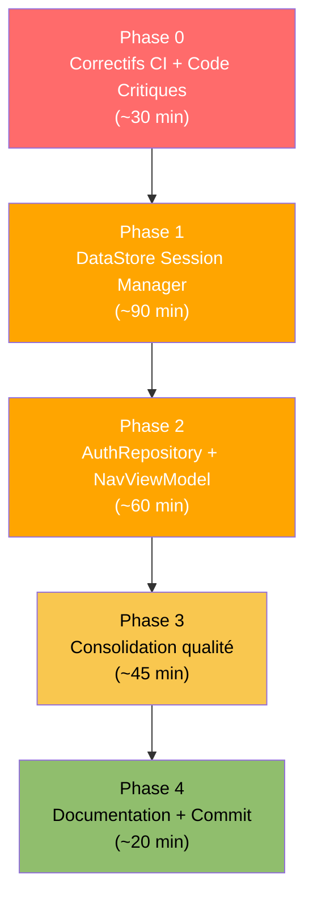

# EXEC-SPRINT2-BACKEND-AGENT — Instructions Agent Codage Backend

> **Rôle de ce fichier** : Instructions séquentielles et exécutables pour l'agent de codage
> Android Studio chargé de la couche données (Room, DataStore, Hilt, CI).
> Lire en entier avant de démarrer. Exécuter les phases dans l'ordre strict.
> Référence bugs : `docs/planification/bugs-pre-sprint2.md`

---

## Contexte de reprise

Missions actives : A4 (bloquée par A0), A5 (bloquée par A4)
Build post-Sprint1 : ✅ OK
Branche de travail : feature/A5-session-hilt-fixes
Commit de départ : tag Sprint-1-done


---

## Séquence globale



---

## Phase 0 — Correctifs CI et code critiques

### 0-A · Corriger android.yml (B-01)

**Fichier :** `.github/workflows/android.yml`

Remplacer :
```yaml
    - name: set up JDK 11
      uses: actions/setup-java@v4
      with:
        java-version: '11'
        distribution: 'temurin'
        cache: gradle
```

Par :
```yaml
    - name: Set up JDK 17
      uses: actions/setup-java@v4
      with:
        java-version: '17'
        distribution: 'temurin'
        cache: gradle
```

---

### 0-B · Corriger codeql.yml (B-02)

**Fichier :** `.github/workflows/codeql.yml`

Remplacer toutes les occurrences de :
```yaml
uses: actions/checkout@v7
```
Par :
```yaml
uses: actions/checkout@v4
```

---

### 0-C · Configurer Room schema export (B-04)

**Fichier :** `app/build.gradle.kts`

Ajouter APRÈS le bloc `compileOptions { }` et AVANT `buildFeatures { }` :

```kotlin
ksp {
    arg("room.schemaLocation", "$projectDir/schemas")
}
```

**Puis créer le répertoire :**
```bash
mkdir -p app/schemas
touch app/schemas/.gitkeep
```

**Modifier `.gitignore`** — ajouter à la fin :
```gitignore
# Versionner les schémas Room pour traçabilité des migrations
# (ne pas ignorer app/schemas/)
```

**Note :** Versionner les schémas Room permet de générer et tester les migrations. Ne pas les ignorer.

---

### 0-D · Consolider NavRoute → Route (B-06)

**Étape 1 — Supprimer** `app/src/main/java/edu/project/dlearn/presentation/navigation/NavRoute.kt`

**Étape 2 — Mettre à jour** `app/src/main/java/edu/project/dlearn/presentation/navigation/NavViewModel.kt`

Remplacer l'import :
```kotlin
// SUPPRIMER cette ligne (si présente) :
// import edu.project.dlearn.presentation.navigation.NavRoute
```

Remplacer toutes les références `NavRoute.XXX` par `Route.XXX` dans `NavViewModel.kt` :
```kotlin
// AVANT :
_destinationInitiale.value = NavRoute.MAIN
_destinationInitiale.value = NavRoute.CONNEXION
_destinationInitiale.value = NavRoute.SELECTION_PROFIL

// APRÈS :
_destinationInitiale.value = Route.MAIN
_destinationInitiale.value = Route.CONNEXION
_destinationInitiale.value = Route.SELECTION_PROFIL
```

**Ajouter l'import manquant dans NavViewModel.kt :**
```kotlin
import edu.project.dlearn.presentation.navigation.Route
```

---

### 0-E · Corriger seed_v1.json (B-09)

**Fichier :** `app/src/main/assets/content/seed_v1.json`

Corrections exactes (chercher/remplacer) :

| Chercher | Remplacer |
|---|---|
| `"Meine famille est groß"` | `"Meine Familie ist groß"` |
| `"Ich wasche mich et ziehe"` | `"Ich wasche mich und ziehe"` |
| `"Serge und seine famille letzten"` | `"Serge und seine Familie letzten"` |
| `"seine famille ___ letzten Sommer"` | `"seine Familie ___ letzten Sommer"` |

**Vérification :** Après correction, lancer :
```bash
grep -n "famille\|est groß\| et " app/src/main/assets/content/seed_v1.json
```
Le grep doit retourner zéro ligne.

---

### 0-F · Ajouter StatutProgression dans son propre fichier (B-12)

**Créer** `app/src/main/java/edu/project/dlearn/domain/model/StatutProgression.kt` :
```kotlin
package edu.project.dlearn.domain.model

enum class StatutProgression { NON_COMMENCE, EN_COURS, TERMINE }
```

**Modifier** `app/src/main/java/edu/project/dlearn/domain/model/Contenu.kt` :

Supprimer la ligne suivante en fin de fichier :
```kotlin
enum class StatutProgression { NON_COMMENCE, EN_COURS, TERMINE }
```

**Vérification build :**
```bash
./gradlew assembleDebug
```
Le build doit passer sans erreur.

---

## Phase 1 — SessionManager (DataStore)

### 1-A · Créer SessionManager

**Créer** `app/src/main/java/edu/project/dlearn/data/local/datasource/SessionManager.kt` :

```kotlin
package edu.project.dlearn.data.local.datasource

import android.content.Context
import androidx.datastore.core.DataStore
import androidx.datastore.preferences.core.Preferences
import androidx.datastore.preferences.core.edit
import androidx.datastore.preferences.core.longPreferencesKey
import androidx.datastore.preferences.core.stringPreferencesKey
import androidx.datastore.preferences.preferencesDataStore
import dagger.hilt.android.qualifiers.ApplicationContext
import edu.project.dlearn.domain.model.Role
import edu.project.dlearn.domain.model.Utilisateur
import kotlinx.coroutines.flow.Flow
import kotlinx.coroutines.flow.map
import javax.inject.Inject
import javax.inject.Singleton

private val Context.sessionDataStore: DataStore<Preferences>
    by preferencesDataStore(name = "liteschreib_session")

/**
 * Persistance de la session utilisateur via DataStore.
 * Survive aux redémarrages de l'application (contrairement à une variable en mémoire).
 * Compatible offline-first (ADR-002) — aucun réseau requis.
 */
@Singleton
class SessionManager @Inject constructor(
    @ApplicationContext private val context: Context
) {
    companion object {
        private val KEY_USER_ID    = longPreferencesKey("session_user_id")
        private val KEY_USER_ROLE  = stringPreferencesKey("session_user_role")
    }

    /** Flow de l'ID de l'utilisateur en session (null si aucune session active). */
    val utilisateurIdFlow: Flow<Long?> = context.sessionDataStore.data
        .map { prefs -> prefs[KEY_USER_ID] }

    /** Persiste la session de l'utilisateur connecté. */
    suspend fun sauvegarderSession(utilisateur: Utilisateur) {
        context.sessionDataStore.edit { prefs ->
            prefs[KEY_USER_ID]   = utilisateur.id
            prefs[KEY_USER_ROLE] = utilisateur.role.name
        }
    }

    /** Supprime la session (déconnexion). */
    suspend fun effacerSession() {
        context.sessionDataStore.edit { it.clear() }
    }
}
```

**Note :** `SessionManager` est annoté `@Singleton` avec `@Inject` constructor — Hilt la fournit automatiquement sans ajout dans `AppModule`. ✅

---

### 1-B · Ajouter UtilisateurDao.trouverParId()

**Modifier** `app/src/main/java/edu/project/dlearn/data/local/room/UtilisateurDao.kt` :

Ajouter après `trouverParIdentifiant` :
```kotlin
@Query("SELECT * FROM utilisateur WHERE id = :id LIMIT 1")
suspend fun trouverParId(id: Long): UtilisateurEntity?
```

---

## Phase 2 — AuthRepository + intégration session

### 2-A · Mettre à jour AuthRepositoryImpl (B-07, B-08)

**Remplacer entièrement** `app/src/main/java/edu/project/dlearn/data/repository/AuthRepositoryImpl.kt` :

```kotlin
package edu.project.dlearn.data.repository

import edu.project.dlearn.data.local.datasource.SessionManager
import edu.project.dlearn.data.local.room.UtilisateurDao
import edu.project.dlearn.data.local.room.UtilisateurEntity
import edu.project.dlearn.domain.model.Role
import edu.project.dlearn.domain.model.Utilisateur
import edu.project.dlearn.domain.repository.AuthRepository
import edu.project.dlearn.domain.repository.ResultatConnexion
import kotlinx.coroutines.flow.Flow
import kotlinx.coroutines.flow.first
import kotlinx.coroutines.flow.map
import java.security.MessageDigest
import javax.inject.Inject

class AuthRepositoryImpl @Inject constructor(
    private val dao: UtilisateurDao,
    private val sessionManager: SessionManager
) : AuthRepository {

    override suspend fun connecter(
        identifiant: String,
        motDePasse: String,
        role: Role
    ): ResultatConnexion {
        val entite = dao.trouverParIdentifiant(identifiant.trim(), role.name)
            ?: return ResultatConnexion.IdentifiantsInvalides
        if (hacher(motDePasse) != entite.motDePasseHash) {
            return ResultatConnexion.IdentifiantsInvalides
        }
        val utilisateur = entite.toDomain()
        sessionManager.sauvegarderSession(utilisateur)
        return ResultatConnexion.Succes(utilisateur)
    }

    override suspend fun connecterAuto(utilisateur: Utilisateur) {
        sessionManager.sauvegarderSession(utilisateur)
    }

    override suspend fun deconnecter() {
        sessionManager.effacerSession()
    }

    override suspend fun utilisateurConnecte(): Utilisateur? {
        val userId = sessionManager.utilisateurIdFlow.first() ?: return null
        return dao.trouverParId(userId)?.toDomain()
    }

    override suspend fun recupererProfilsLocaux(): List<Utilisateur> {
        return dao.recupererTous().map { it.toDomain() }
    }

    override fun getAllProfils(): Flow<List<Utilisateur>> =
        dao.getAllUtilisateurs().map { list -> list.map { it.toDomain() } }

    // --- Helpers privés ---

    private fun UtilisateurEntity.toDomain() = Utilisateur(
        id          = id,
        identifiant = identifiant,
        nomAffiche  = nomAffiche,
        role        = Role.valueOf(role),
        classe      = classe,
        niveau      = niveau
    )

    // TODO production : remplacer SHA-256 nu par PBKDF2/BCrypt avec sel.
    private fun hacher(valeur: String): String =
        MessageDigest.getInstance("SHA-256")
            .digest(valeur.toByteArray())
            .joinToString("") { "%02x".format(it) }
}
```

---

### 2-B · Créer constante partagée ELEVE_DEMO_ID (B-10)

**Créer** `app/src/main/java/edu/project/dlearn/core/AppConstants.kt` :

```kotlin
package edu.project.dlearn.core

/**
 * Constantes partagées entre les couches de l'application.
 * Les valeurs _DEMO sont des placeholders Sprint 2 → à remplacer par la session DataStore (A5).
 */
object AppConstants {
    /**
     * ID de l'élève de démo seedé par [SeedCallback] dans AppModule.
     * Correspond au premier enregistrement INSERT dans la table utilisateur (auto-increment = 1).
     * À remplacer dès que SessionManager est câblé dans les ViewModels (Sprint 3).
     */
    const val ELEVE_DEMO_ID: Long = 1L
}
```

**Mettre à jour** `ApprentissageRepositoryImpl.kt` :
```kotlin
// AVANT :
val eleveIdProvisoire = 1L
// APRÈS :
val eleveIdProvisoire = AppConstants.ELEVE_DEMO_ID
```
Import : `import edu.project.dlearn.core.AppConstants`

**Mettre à jour** `EcritureViewModel.kt` :
```kotlin
// AVANT :
private const val ELEVE_ID_DEMO = 1L
// APRÈS :
private val ELEVE_ID_DEMO = AppConstants.ELEVE_DEMO_ID
```

**Mettre à jour** `SuiviViewModel.kt` :
```kotlin
// AVANT :
private const val ELEVE_ID_DEMO = 1L
// APRÈS :
private val ELEVE_ID_DEMO = AppConstants.ELEVE_DEMO_ID
```

---

## Phase 3 — Tests unitaires AuthRepository

### 3-A · Test SessionManager (smoke test)

**Créer** `app/src/test/java/edu/project/dlearn/data/repository/AuthRepositoryTest.kt` :

```kotlin
package edu.project.dlearn.data.repository

import edu.project.dlearn.domain.model.Role
import edu.project.dlearn.domain.model.Utilisateur
import edu.project.dlearn.domain.repository.ResultatConnexion
import kotlinx.coroutines.test.runTest
import org.junit.Assert.assertEquals
import org.junit.Assert.assertNotNull
import org.junit.Assert.assertNull
import org.junit.Test

/**
 * Tests unitaires légers pour AuthRepositoryImpl.
 * L'implémentation Room est testée via des tests d'instrumentation (InstrumentedTest).
 * Ces tests vérifient la logique de hachage et le schéma de retour uniquement.
 */
class AuthRepositoryTest {

    @Test
    fun `hash SHA256 produit une chaine hexadecimale de 64 caracteres`() {
        // SHA-256 produit 32 octets = 64 hexadécimaux
        val hacheur = { valeur: String ->
            java.security.MessageDigest.getInstance("SHA-256")
                .digest(valeur.toByteArray())
                .joinToString("") { "%02x".format(it) }
        }
        val hash = hacheur("eleve1234")
        assertEquals(64, hash.length)
        // Le hash de "eleve1234" doit correspondre au SeedCallback
        assertEquals(
            "0d62b61ff9b60f8082d22dae0d0a7f7330b7729d323f8401d723511e2e7ca7e8",
            hash
        )
    }
}
```

---

## Phase 4 — Vérification finale et commit

### 4-A · Build complet

```bash
./gradlew clean assembleDebug
./gradlew testDebugUnitTest
./gradlew lintDebug
```

Tous les trois doivent passer sans erreur.

### 4-B · Vérification grep bugs résolus

```bash
# B-01 : JDK 17 dans android.yml
grep "java-version" .github/workflows/android.yml | grep "17"

# B-02 : checkout@v4 dans codeql.yml  
grep "checkout" .github/workflows/codeql.yml | grep "@v4"

# B-04 : KSP arg Room schema
grep "room.schemaLocation" app/build.gradle.kts

# B-06 : NavRoute.kt supprimé
test ! -f app/src/main/java/edu/project/dlearn/presentation/navigation/NavRoute.kt && echo "OK"

# B-07 : utilisateurConnecte() ne retourne plus null hardcodé  
grep "return null" app/src/main/java/edu/project/dlearn/data/repository/AuthRepositoryImpl.kt | wc -l
# Doit retourner 0

# B-08 : recupererProfilsLocaux() ne retourne plus emptyList()
grep "emptyList" app/src/main/java/edu/project/dlearn/data/repository/AuthRepositoryImpl.kt | wc -l
# Doit retourner 0

# B-09 : plus de mots français dans les textes allemands
grep -n "famille\| est groß\| et " app/src/main/assets/content/seed_v1.json | wc -l
# Doit retourner 0
```

### 4-C · Commit

```bash
git add -A
git commit -m "fix(backend): correctifs critiques Sprint 2 — CI JDK17, Room schema, SessionManager, AuthRepository, NavRoute consolidation"
git push origin feature/A5-session-hilt-fixes
```

---

## Anomalies à suivre

| # | Description | Impact si ignoré | Priorité |
|---|---|---|---|
| AN-B-01 | DB version=3 sans migrations explicites | Perte données élève à la mise à jour | Avant D0 |
| AN-B-02 | SHA-256 sans sel — AuthRepositoryImpl | Vulnérabilité hashage pour pilote réel | Avant D3 |
| AN-B-03 | `eleveIdProvisoire` encore présent dans les caches ViewModel | Sessions incorrectes si utilisateur ≠ démo | Sprint 3 |

---

## DoD de cette session Backend

- [ ] `android.yml` utilise JDK 17
- [ ] `codeql.yml` utilise `checkout@v4`
- [ ] `app/schemas/` créé, KSP arg configuré
- [ ] `NavRoute.kt` supprimé, `NavViewModel.kt` référence `Route`
- [ ] `seed_v1.json` sans mots français dans les textes allemands
- [ ] `StatutProgression` dans son propre fichier
- [ ] `SessionManager.kt` créé et fonctionnel
- [ ] `UtilisateurDao.trouverParId()` ajouté
- [ ] `AuthRepositoryImpl` injecte `SessionManager`
- [ ] `utilisateurConnecte()` lit DataStore
- [ ] `recupererProfilsLocaux()` lit Room
- [ ] `AppConstants.ELEVE_DEMO_ID` utilisé partout
- [ ] Build propre : `./gradlew assembleDebug` sans erreur
- [ ] Tests unitaires passants : `./gradlew testDebugUnitTest`
