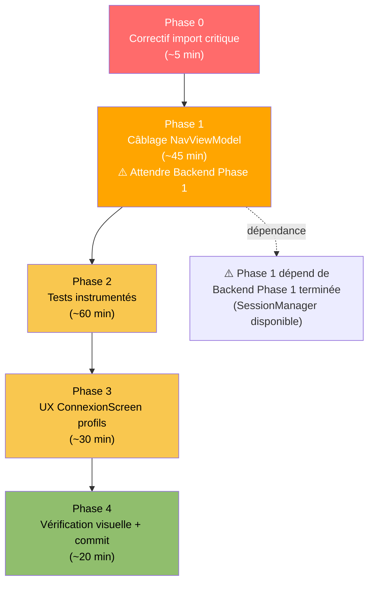

# EXEC-SPRINT2-FRONTEND-AGENT — Instructions Agent Codage Frontend

> **Rôle de ce fichier** : Instructions séquentielles pour l'agent de codage Android Studio
> chargé de la couche présentation (Compose UI, Navigation, Tests instrumentés).
> Phase 0 peut démarrer en parallèle du Backend. Phase 1+ nécessite que le Backend
> ait terminé Phase 1 (SessionManager + AuthRepositoryImpl).
> Référence bugs : `docs/planification/bugs-pre-sprint2.md`

---

## Contexte de reprise

Missions actives : A3 (Validation), A1 (Validation)
Build post-Sprint1 : ✅ OK
Branche de travail : feature/A3-A5-nav-session-ui


---

## Séquence globale



---

## Phase 0 — Correctif import critique (indépendant)

### 0-A · Corriger import hiltViewModel dans AccueilScreen (B-03)

**Fichier :** `app/src/main/java/edu/project/dlearn/presentation/accueil/AccueilScreen.kt`

**Trouver et remplacer :**
```kotlin
// AVANT (import incorrect — package inexistant dans hilt-navigation-compose:1.4.0) :
import androidx.hilt.lifecycle.viewmodel.compose.hiltViewModel

// APRÈS (import canonique) :
import androidx.hilt.navigation.compose.hiltViewModel
```

**Vérification immédiate :**
```bash
./gradlew :app:compileDebugKotlin
```
Doit compiler sans erreur on `AccueilScreen.kt`.

---

## Phase 1 — Câblage NavViewModel dans LiteschreibApp()

> ⚠️ **Prérequis :** Backend Phase 1 et 2 terminées.
> `SessionManager`, `utilisateurConnecte()` et `recupererProfilsLocaux()` doivent être fonctionnels.

### 1-A · Mettre à jour LiteschreibApp() dans NavGraph.kt

**Fichier :** `app/src/main/java/edu/project/dlearn/presentation/navigation/NavGraph.kt`

**Remplacer la fonction `LiteschreibApp()` entière :**

```kotlin
/**
 * Point d'entrée Compose post-splash. Détermine la route initiale via [NavViewModel]
 * (session persistée → MAIN, multi-profil → SELECTION_PROFIL, vide → CONNEXION).
 *
 * Affiche un indicateur de chargement pendant la résolution de la destination initiale
 * (typiquement < 100 ms, lecture DataStore).
 */
@Composable
fun LiteschreibApp() {
    val navViewModel: NavViewModel = hiltViewModel()
    val destinationInitiale by navViewModel.destinationInitiale.collectAsState()
    val navController = rememberNavController()

    // Écran de démarrage pendant la résolution de la session
    if (destinationInitiale == null) {
        Box(
            modifier = Modifier
                .fillMaxSize()
                .background(MaterialTheme.colorScheme.background),
            contentAlignment = Alignment.Center
        ) {
            CircularProgressIndicator(color = MaterialTheme.colorScheme.primary)
        }
        return
    }

    NavHost(
        navController    = navController,
        startDestination = destinationInitiale!!
    ) {
        composable(Route.CONNEXION) {
            ConnexionScreen(
                onConnexionReussie = { role ->
                    naviguerApresConnexion(navController, role)
                },
                onNaviguerVersSelectionProfil = {
                    navController.navigate(Route.SELECTION_PROFIL)
                },
                onDemanderCompte = {
                    navController.navigate(Route.CREATION_ELEVE)
                }
            )
        }

        composable(Route.SELECTION_PROFIL) {
            SelectionProfilScreen(
                onProfilSelectionne = { _ ->
                    navController.navigate(Route.MAIN) {
                        popUpTo(0) { inclusive = true }
                    }
                },
                onAutreCompte = {
                    navController.navigate(Route.CONNEXION) {
                        popUpTo(Route.SELECTION_PROFIL) { inclusive = true }
                    }
                }
            )
        }

        composable(Route.POSITIONNEMENT) {
            PositionnementScreen(
                onTermine = {
                    navController.navigate(Route.MAIN) { popUpTo(0) }
                }
            )
        }

        composable(Route.MAIN) {
            MainScreen(role = Role.ELEVE) {
                navController.navigate(Route.CONNEXION) {
                    popUpTo(0) { inclusive = true }
                }
            }
        }

        composable(Route.CREATION_ELEVE) {
            CreationEleveScreen(
                onBack = { navController.popBackStack() },
                onCreateStudent = { _, _, _ ->
                    navController.navigate(Route.RESULTAT_CREATION_ELEVE)
                }
            )
        }

        composable(Route.RESULTAT_CREATION_ELEVE) {
            val mockUtilisateur = Utilisateur(
                id          = 999L,
                identifiant = "eleve.demo",
                nomAffiche  = "Divine K.",
                role        = Role.ELEVE,
                classe      = "6e A",
                niveau      = "A1",
                motDePasse  = "ikii.1234"
            )
            ResultatCreationEleveScreen(
                utilisateur = mockUtilisateur,
                onDone = {
                    navController.navigate(Route.CONNEXION) {
                        popUpTo(Route.CREATION_ELEVE) { inclusive = true }
                    }
                }
            )
        }
    }
}
```

**Ajouter les imports manquants en tête de `NavGraph.kt` :**
```kotlin
import androidx.compose.foundation.background
import androidx.compose.foundation.layout.Box
import androidx.compose.foundation.layout.fillMaxSize
import androidx.compose.material3.CircularProgressIndicator
import androidx.compose.material3.MaterialTheme
import androidx.compose.runtime.collectAsState
import androidx.compose.runtime.getValue
import androidx.hilt.navigation.compose.hiltViewModel
import edu.project.dlearn.presentation.navigation.NavViewModel
```

---

### 1-B · Vérifier que NavViewModel compile correctement

Après la consolidation `NavRoute` → `Route` effectuée par le Backend (B-06),
vérifier que `NavViewModel.kt` compile sans erreur :

```bash
./gradlew :app:compileDebugKotlin 2>&1 | grep -i "navviewmodel\|navroute\|error"
```

Aucune erreur ne doit apparaître.

---

## Phase 2 — Tests instrumentés

### 2-A · Ajouter testTags sur ConnexionScreen (B-11)

**Modifier** `app/src/main/java/edu/project/dlearn/presentation/connexion/ConnexionScreen.kt`

Ajouter les imports :
```kotlin
import androidx.compose.ui.platform.testTag
```

Ajouter le `testTag` sur le champ identifiant (chercher le composable `AppTextField` pour l'identifiant) :
```kotlin
AppTextField(
    value = etat.identifiant,
    onValueChange = viewModel::onChangerIdentifiant,
    label = "Identifiant",
    placeholder = "ex : eleve.2451",
    leadingIcon = Icons.Default.Person,
    enabled = !etat.enChargement,
    modifier = Modifier.testTag("champ_identifiant")  // ← AJOUTER
)
```

Ajouter le `testTag` sur le bouton de connexion :
```kotlin
Button(
    onClick = viewModel::onSeConnecter,
    modifier = Modifier
        .fillMaxWidth()
        .height(52.dp)
        .testTag("bouton_connexion"),  // ← AJOUTER
    enabled = !etat.enChargement
) { ... }
```

---

### 2-B · Mettre à jour AppTextField pour accepter un modifier

**Modifier** `app/src/main/java/edu/project/dlearn/core/components/AppTextField.kt`

Le `modifier` existe déjà en paramètre. Vérifier qu'il est bien appliqué :
```kotlin
OutlinedTextField(
    value = value,
    onValueChange = onValueChange,
    modifier = modifier.fillMaxWidth(),  // ← modifier externe appliqué en premier
    ...
)
```
✅ Déjà correct — aucune modification nécessaire si `modifier` est bien passé par l'appelant.

---

### 2-C · Refactorer NavigationTest avec les nouveaux testTags (B-11)

**Remplacer entièrement** `app/src/androidTest/java/edu/project/dlearn/navigation/NavigationTest.kt` :

```kotlin
package edu.project.dlearn.navigation

import androidx.compose.ui.test.assertIsDisplayed
import androidx.compose.ui.test.junit4.createAndroidComposeRule
import androidx.compose.ui.test.onNodeWithTag
import androidx.compose.ui.test.onNodeWithText
import androidx.compose.ui.test.performClick
import androidx.compose.ui.test.performTextInput
import androidx.test.ext.junit.runners.AndroidJUnit4
import dagger.hilt.android.testing.HiltAndroidRule
import dagger.hilt.android.testing.HiltAndroidTest
import edu.project.dlearn.MainActivity
import org.junit.Before
import org.junit.Rule
import org.junit.Test
import org.junit.runner.RunWith

@HiltAndroidTest
@RunWith(AndroidJUnit4::class)
class NavigationTest {

    @get:Rule(order = 0) val hiltRule = HiltAndroidRule(this)
    @get:Rule(order = 1) val composeRule = createAndroidComposeRule<MainActivity>()

    @Before
    fun setUp() {
        hiltRule.inject()
    }

    /** Scénario 1 : démarrage → ConnexionScreen visible (aucune session persistée). */
    @Test
    fun demarrage_sans_session_affiche_ecran_connexion() {
        // "Liteschreib IKII" apparaît dans ConnexionScreen ET SelectionProfilScreen
        composeRule.onNodeWithText("Liteschreib IKII").assertIsDisplayed()
    }

    /** Scénario 2 : connexion élève de démo → PositionnementScreen. */
    @Test
    fun connexion_eleve_demo_navigue_vers_positionnement() {
        // S'assurer qu'on est sur ConnexionScreen
        composeRule.waitUntil(3_000) {
            composeRule.onAllNodes(
                androidx.compose.ui.test.hasText("Liteschreib IKII")
            ).fetchSemanticsNodes().isNotEmpty()
        }

        // Sélectionner le rôle Élève
        composeRule.onNodeWithText("Élève").performClick()

        // Saisir l'identifiant via testTag
        composeRule.onNodeWithTag("champ_identifiant").performTextInput("eleve.2451")

        // Saisir le mot de passe (chercher le champ mot de passe par label)
        composeRule.onNodeWithText("Mot de passe").performClick()
        // Le mot de passe est saisi via le champ PasswordField — chercher par son label
        composeRule.onNodeWithTag("champ_mot_de_passe").performTextInput("eleve1234")

        // Cliquer sur Se connecter
        composeRule.onNodeWithTag("bouton_connexion").performClick()
        composeRule.waitForIdle()

        // Après connexion Élève → PositionnementScreen
        composeRule.waitUntil(5_000) {
            composeRule.onAllNodes(
                androidx.compose.ui.test.hasText("Test de positionnement")
            ).fetchSemanticsNodes().isNotEmpty()
        }
        composeRule.onNodeWithText("Test de positionnement · Question 1/10")
            .assertIsDisplayed()
    }

    /** Scénario 3 : connexion enseignant → MainScreen sans positionnement. */
    @Test
    fun connexion_enseignant_demo_navigue_directement_vers_dashboard() {
        composeRule.waitUntil(3_000) {
            composeRule.onAllNodes(
                androidx.compose.ui.test.hasText("Liteschreib IKII")
            ).fetchSemanticsNodes().isNotEmpty()
        }

        composeRule.onNodeWithText("Enseignant").performClick()
        composeRule.onNodeWithTag("champ_identifiant").performTextInput("enseignant.100")
        composeRule.onNodeWithTag("champ_mot_de_passe").performTextInput("enseignant1234")
        composeRule.onNodeWithTag("bouton_connexion").performClick()
        composeRule.waitForIdle()

        // Enseignant → EnseignantDashboardScreen directement
        composeRule.waitUntil(5_000) {
            composeRule.onAllNodes(
                androidx.compose.ui.test.hasText("Classe")
            ).fetchSemanticsNodes().isNotEmpty()
        }
    }

    /** Scénario 4 : navigation 5 onglets élève sans crash. */
    @Test
    fun navigation_cinq_onglets_eleve_sans_crash() {
        // TODO Sprint 3 : automatiser la connexion puis vérifier les 5 onglets.
        // Dépend de la session DataStore persistée entre les tests.
        // Pour l'instant : vérifier que le test compile (aucune assertion).
    }
}
```

**Ajouter également** le testTag sur le `PasswordField` dans `ConnexionScreen.kt` :
```kotlin
PasswordField(
    value = etat.motDePasse,
    onValueChange = viewModel::onChangerMotDePasse,
    visible = etat.motDePasseVisible,
    onVisibilityChange = viewModel::onToggleVisibiliteMotDePasse,
    enabled = !etat.enChargement,
    modifier = Modifier.testTag("champ_mot_de_passe")  // ← AJOUTER
)
```

**Vérifier que `PasswordField` accepte le modifier :**
```kotlin
// Dans PasswordField.kt, le OutlinedTextField doit utiliser modifier.fillMaxWidth() :
OutlinedTextField(
    modifier = modifier.fillMaxWidth(), // ← 'modifier' doit être le paramètre, pas Modifier
    ...
)
```
✅ Déjà correct dans la version actuelle.

---

## Phase 3 — UX ConnexionScreen : clic profil (B-13)

> Note : Correction partielle uniquement. La correction complète (clic → connexion directe
> avec vérification optionnelle du PIN ADR-009) nécessite la session DataStore (Backend Phase 1).

### 3-A · Améliorer le comportement des boutons de profil

**Modifier** la section profils existants dans `ConnexionScreen.kt` :

```kotlin
if (etat.profilsExistants.isNotEmpty()) {
    HorizontalDivider(modifier = Modifier.padding(vertical = 8.dp))
    Text(
        "Déjà sur cet appareil",
        style = MaterialTheme.typography.labelLarge,
        modifier = Modifier.fillMaxWidth()
    )
    Spacer(Modifier.height(8.dp))
    etat.profilsExistants.take(3).forEach { profil ->
        OutlinedButton(
            // CORRECTION B-13 : naviguer vers SelectionProfilScreen
            // (la sélection fine par profil individuel y est gérée)
            onClick = viewModel::onVoirProfilsExistants,
            modifier = Modifier.fillMaxWidth().height(48.dp)
        ) {
            InitialsAvatar(profil.nomAffiche, taille = 28.dp)
            Spacer(Modifier.width(8.dp))
            Column(modifier = Modifier.weight(1f),
                   horizontalAlignment = Alignment.Start) {
                Text(profil.nomAffiche,
                     style = MaterialTheme.typography.bodyMedium,
                     fontWeight = FontWeight.SemiBold)
                Text(
                    text = if (profil.role == Role.ELEVE)
                               "Élève${profil.classe?.let { " · $it" } ?: ""}"
                           else "Enseignant",
                    style = MaterialTheme.typography.bodySmall,
                    color = MaterialTheme.colorScheme.onSurfaceVariant
                )
            }
        }
        Spacer(Modifier.height(4.dp))
    }
    // ...
}
```

**Ajouter l'import** si manquant :
```kotlin
import androidx.compose.ui.text.font.FontWeight
```

---

## Phase 4 — Vérification visuelle et commit

### 4-A · Build instrumentation

```bash
./gradlew assembleDebugAndroidTest
```

Si un émulateur ou device est connecté :
```bash
./gradlew connectedDebugAndroidTest
```

### 4-B · Vérification manuelle sur device (checklist)

Déployer sur le Redmi Note 15 Pro (USB debugging activé).

| Scénario | Résultat attendu | ✓/✗ |
|---|---|---|
| Lancement sans session | ConnexionScreen avec logo | |
| Connexion eleve.2451 / eleve1234 | PositionnementScreen 1/10 | |
| Connexion enseignant.100 / enseignant1234 | Dashboard enseignant | |
| Relancement après connexion élève | PositionnementScreen (session DataStore) | |
| Navigation 5 onglets élève | Aucun crash | |
| Déconnexion depuis Profil | Retour ConnexionScreen | |
| Mode avion — tous les onglets | Fonctionnement intégral | |
| Orientation portrait → paysage | Pas de perte d'état | |

### 4-C · Screenshot et archivage

```bash
# Depuis Android Studio : Tools > Layout Inspector > Screenshot
# Nommer les captures : docs/screenshots/A3/sprint2-connexion.png, etc.
mkdir -p docs/screenshots/A3
mkdir -p docs/screenshots/A5
```

### 4-D · Commit

```bash
git add -A
git commit -m "fix(frontend): câblage NavViewModel, correctif import hiltViewModel, tests instrumentés refactorisés"
git push origin feature/A3-A5-nav-session-ui
```

---

## Anomalies à documenter

| # | Description | Fichier | Note |
|---|---|---|---|
| AN-F-01 | `MainScreen` reçoit `role = Role.ELEVE` hardcodé (pas de la session) | `NavGraph.kt` | Résoudre Sprint 3 avec sessionManager dans NavViewModel |
| AN-F-02 | `AccueilViewModel` utilise données mockées (prenom = "Lena") | `AccueilViewModel.kt` | Résoudre Sprint 4 (Mission B1) |
| AN-F-03 | `ProfilViewModel` données mockées (nomComplet = "Aïcha N.") | `ProfilViewModel.kt` | Résoudre Sprint 4 (Mission B1) |
| AN-F-04 | `PositionnementScreen` passe par un `LaunchedEffect` pour naviguer | `PositionnementScreen.kt` | Fugace mais acceptable pour Sprint 2 |

---

## DoD de cette session Frontend

- [ ] `AccueilScreen.kt` utilise `androidx.hilt.navigation.compose.hiltViewModel`
- [ ] `LiteschreibApp()` instancie et observe `NavViewModel`
- [ ] Écran de chargement affiché pendant résolution de destination initiale
- [ ] `NavViewModel` ne référence plus `NavRoute` (consolidé vers `Route`)
- [ ] `testTag("champ_identifiant")` sur le champ identifiant de ConnexionScreen
- [ ] `testTag("champ_mot_de_passe")` sur le champ mot de passe
- [ ] `testTag("bouton_connexion")` sur le bouton Se connecter
- [ ] `NavigationTest.kt` utilise `onNodeWithTag` au lieu de `onNodeWithText` for the inputs
- [ ] Build instrumentation propre
- [ ] Vérification manuelle sur device passée (table ci-dessus)
- [ ] Screenshots archivés dans `docs/screenshots/A3/` et `docs/screenshots/A5/`
