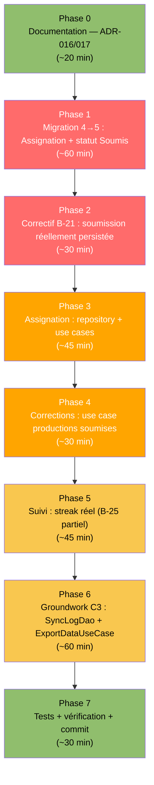

# EXEC-SPRINT3-BACKEND-AGENT — Instructions Agent Codage Backend

> **Rôle de ce fichier** : Instructions séquentielles et exécutables pour l'agent de codage Android Studio
> chargé de la couche données (Room, migrations, use cases) pour la continuation du Sprint 3.
> Lire en entier avant de démarrer. Exécuter les phases dans l'ordre strict.
> Référence bugs : `docs/planification/RECONCILIATION-SPRINT3.md` (catalogue B-21 à B-27)

---

## Contexte de reprise

Build actuel : ✅ OK (AppDatabase version 4, migration 3→4 testée)
Branche de travail : feature/C2-assignation-corrections-backend
Commit de départ : dernier commit on `develop`

Ce sprint ferme les stubs non fonctionnels du dashboard enseignant (Assigner, Corrections) et amorce la
Mission C3 (synchronisation) côté données uniquement. Le Frontend Agent dépend de Phase 1 et Phase 2 de ce
fichier avant de pouvoir câbler ses écrans.

---

## Séquence globale



---

## Phase 0 — Documentation (ADR-016, ADR-017)

### 0-A · Intégrer les ADR dans `06-architecture-technique.md`

Copier le contenu des sections 4 et 5 de `docs/planification/RECONCILIATION-SPRINT3.md` (ADR-016 et ADR-017,
texte déjà rédigé) directement après ADR-015. Mettre à jour la table récapitulative de la section 6 :

```markdown
| ADR-016 | Simplification du schéma de données — unification ProfilEleve/ProfilEnseignant | Accepted |
| ADR-017 | Politique de migration Room pré-pilote | Accepted |
```

### 0-B · Mettre à jour `11-schema-donnees-room.md`

- Remplacer le diagramme de la section 1 par celui de la section 6 de `RECONCILIATION-SPRINT3.md`.
- Déplacer les entités `ProfilEleve`, `ProfilEnseignant`, `Classe` (section 2 actuelle) dans une nouvelle
  sous-section *"2-bis. Modèle initialement envisagé, non retenu — voir ADR-016"*, sans les supprimer.
- Ajouter l'entité `Assignation` réelle (voir Phase 1 ci-dessous) à la section 2, avec son schéma effectif
  (`enseignantId: Long`, `cibleType: String`, `cibleId: String`, `uniteId: String`).
- Ajouter une ligne au tableau de la section 4 : *"Migration 4→5 : ajout `assignation`, ajout colonne
  `statut` sur `production_ecrite` — voir ADR-017."*

### 0-C · Mettre à jour `05-checklist-quotidienne.md`

Ajouter dans la section "Checklist avant merge sur develop/main" :
```markdown
- [ ] Si `AppDatabase.kt` est modifié (version bump), une `Migration` explicite et un test `MigrationTestHelper` associé sont présents (ADR-017)
```

### 0-D · Ajouter un risque à `08-registre-des-risques.md`

Dans la table "Risques techniques", ajouter :
```markdown
| R-18 *(nouveau)* | Absence de table `Classe` relationnelle (ADR-016) — pas de cloisonnement élèves/enseignant en cas de pilote multi-enseignants sur appareils partagés | Faible | Moyen | Modérée | Réévaluer si le pilote s'étend au-delà d'un enseignant/classe par appareil ; migration vers un modèle relationnel si nécessaire | Ouvert | ADR-016 |
```

---

## Phase 1 — Migration 4→5 : Assignation + statut Soumis

### 1-A · Créer `AssignationEntity`

**Créer** `app/src/main/java/edu/project/dlearn/data/local/room/AssignationEntity.kt` :

```kotlin
package edu.project.dlearn.data.local.room

import androidx.room.Entity
import androidx.room.PrimaryKey

// cibleType : "ELEVE" | "CLASSE"
// cibleId : identifiant élève (Long en String) si ELEVE, valeur de UtilisateurEntity.classe si CLASSE
@Entity(tableName = "assignation")
data class AssignationEntity(
    @PrimaryKey val id: String,
    val enseignantId: Long,
    val cibleType: String,
    val cibleId: String,
    val uniteId: String,
    val dateAssignation: Long = System.currentTimeMillis()
)
```

### 1-B · Créer `AssignationDao`

**Créer** `app/src/main/java/edu/project/dlearn/data/local/room/AssignationDao.kt` :

```kotlin
package edu.project.dlearn.data.local.room

import androidx.room.Dao
import androidx.room.Insert
import androidx.room.OnConflictStrategy
import androidx.room.Query
import kotlinx.coroutines.flow.Flow

@Dao
interface AssignationDao {

    @Insert(onConflict = OnConflictStrategy.REPLACE)
    suspend fun insert(assignation: AssignationEntity)

    @Query("SELECT * FROM assignation WHERE cibleType = 'ELEVE' AND cibleId = :eleveId ORDER BY dateAssignation DESC")
    fun getPourEleve(eleveId: String): Flow<List<AssignationEntity>>

    @Query("SELECT * FROM assignation WHERE cibleType = 'CLASSE' AND cibleId = :classe ORDER BY dateAssignation DESC")
    fun getPourClasse(classe: String): Flow<List<AssignationEntity>>

    @Query("SELECT * FROM assignation WHERE enseignantId = :enseignantId ORDER BY dateAssignation DESC")
    fun getParEnseignant(enseignantId: Long): Flow<List<AssignationEntity>>
}
```

### 1-C · Ajouter le champ `statut` à `ProductionEcriteEntity`

**Modifier** `app/src/main/java/edu/project/dlearn/data/local/room/ProductionEcriteEntity.kt` :

```kotlin
package edu.project.dlearn.data.local.room

import androidx.room.Entity
import androidx.room.PrimaryKey

// autoEvaluationJson : résultat JSON de la grille FR-17 (longueur, cohérence, vocabulaire)
// Format : {"longueur": true, "coherence": false, "vocabulaire": true}
// statut (ajouté v5, correctif B-21) : "BROUILLON" | "SOUMIS"
@Entity(tableName = "production_ecrite")
data class ProductionEcriteEntity(
    @PrimaryKey val id: String,
    val eleveId: Long,
    val uniteId: String,
    val contenuTexte: String,
    val dateCreation: Long = System.currentTimeMillis(),
    val dateModification: Long = System.currentTimeMillis(),
    val autoEvaluationJson: String? = null,
    val statut: String = "BROUILLON"
)
```

### 1-D · Ajouter les requêtes correspondantes à `ProductionEcriteDao`

**Modifier** `app/src/main/java/edu/project/dlearn/data/local/room/ProductionEcriteDao.kt` — ajouter :

```kotlin
@Query("SELECT * FROM production_ecrite WHERE statut = 'SOUMIS' ORDER BY dateModification DESC")
fun getProductionsSoumises(): Flow<List<ProductionEcriteEntity>>

@Query("UPDATE production_ecrite SET statut = :statut, contenuTexte = :contenuTexte, autoEvaluationJson = :autoEvaluationJson, dateModification = :dateModification WHERE id = :id")
suspend fun marquerSoumise(
    id: String,
    contenuTexte: String,
    autoEvaluationJson: String?,
    statut: String = "SOUMIS",
    dateModification: Long = System.currentTimeMillis()
)
```

### 1-E · Créer `SyncLogDao` (correctif B-22)

**Créer** `app/src/main/java/edu/project/dlearn/data/local/room/SyncLogDao.kt` :

```kotlin
package edu.project.dlearn.data.local.room

import androidx.room.Dao
import androidx.room.Insert
import androidx.room.OnConflictStrategy
import androidx.room.Query
import kotlinx.coroutines.flow.Flow

@Dao
interface SyncLogDao {

    @Insert(onConflict = OnConflictStrategy.REPLACE)
    suspend fun insert(log: SyncLogEntity)

    @Query("SELECT * FROM sync_log ORDER BY dateSync DESC LIMIT 1")
    fun getDernierLog(): Flow<SyncLogEntity?>

    @Query("SELECT * FROM sync_log ORDER BY dateSync DESC")
    fun getTousLesLogs(): Flow<List<SyncLogEntity>>
}
```

### 1-F · Migration 4→5

**Modifier** `app/src/main/java/edu/project/dlearn/data/local/room/AppDatabase.kt` :

```kotlin
package edu.project.dlearn.data.local.room

import androidx.room.Database
import androidx.room.RoomDatabase
import androidx.room.migration.Migration
import androidx.sqlite.db.SupportSQLiteDatabase

/**
 * Version 5 : ajout table `assignation` (FR-26) et colonne `statut` sur `production_ecrite` (correctif B-21).
 * Migration 4→5 testée — voir ADR-017 : à partir de cette version, toute migration DOIT être explicite et testée.
 *
 * TODO(dette-technique, priorité: avant-pilote D0) :
 * Supprimer fallbackToDestructiveMigration() et implémenter Migration(2,3) avant D0 — ADR-017 accepte ce
 * report jusqu'à la version 4 uniquement ; aucune exception au-delà.
 */
@Database(
    entities = [
        VocabEntity::class,
        UtilisateurEntity::class,
        UniteApprentissageEntity::class,
        ExtraitLitteraireEntity::class,
        GlossaireEntreeEntity::class,
        ExerciceEntity::class,
        OptionExerciceEntity::class,
        ProgressionEntity::class,
        ProductionEcriteEntity::class,
        ReponseEleveEntity::class,
        SyncLogEntity::class,
        AssignationEntity::class,
    ],
    version = 5,
    exportSchema = true
)
abstract class AppDatabase : RoomDatabase() {
    abstract fun apprentissageDao(): ApprentissageDao
    abstract fun utilisateurDao(): UtilisateurDao
    abstract fun contenuDao(): ContenuDao
    abstract fun progressionDao(): ProgressionDao
    abstract fun productionEcriteDao(): ProductionEcriteDao
    abstract fun assignationDao(): AssignationDao
    abstract fun syncLogDao(): SyncLogDao

    companion object {
        /** ADR-015 : ajout du champ isValidated dans unite_apprentissage. */
        val MIGRATION_3_4 = object : Migration(3, 4) {
            override fun migrate(database: SupportSQLiteDatabase) {
                database.execSQL(
                    "ALTER TABLE unite_apprentissage ADD COLUMN isValidated INTEGER NOT NULL DEFAULT 0"
                )
            }
        }

        /** ADR-017 : première migration sous la nouvelle politique — testée par MigrationTest.kt. */
        val MIGRATION_4_5 = object : Migration(4, 5) {
            override fun migrate(database: SupportSQLiteDatabase) {
                database.execSQL(
                    """
                    CREATE TABLE IF NOT EXISTS `assignation` (
                        `id` TEXT NOT NULL,
                        `enseignantId` INTEGER NOT NULL,
                        `cibleType` TEXT NOT NULL,
                        `cibleId` TEXT NOT NULL,
                        `uniteId` TEXT NOT NULL,
                        `dateAssignation` INTEGER NOT NULL,
                        PRIMARY KEY(`id`)
                    )
                    """.trimIndent()
                )
                database.execSQL(
                    "ALTER TABLE production_ecrite ADD COLUMN statut TEXT NOT NULL DEFAULT 'BROUILLON'"
                )
            }
        }
    }
}
```

### 1-G · Enregistrer la migration et les DAO dans Hilt

**Modifier** `app/src/main/java/edu/project/dlearn/core/di/AppModule.kt` — dans `DatabaseModule` :

```kotlin
@Provides
@Singleton
fun provideAppDatabase(@ApplicationContext context: Context): AppDatabase =
    Room.databaseBuilder(context, AppDatabase::class.java, "liteschreib.db")
        .fallbackToDestructiveMigration()
        .addMigrations(AppDatabase.MIGRATION_3_4, AppDatabase.MIGRATION_4_5)
        .addCallback(SeedCallback)
        .build()

// ... (providers existants inchangés) ...

@Provides
fun provideAssignationDao(database: AppDatabase): AssignationDao = database.assignationDao()

@Provides
fun provideSyncLogDao(database: AppDatabase): SyncLogDao = database.syncLogDao()
```

### 1-H · Vérification build

```bash
./gradlew assembleDebug
```
Doit compiler sans erreur. Vérifier que `app/schemas/edu.project.dlearn.data.local.room.AppDatabase/5.json`
est bien généré.

---

## Phase 2 — Correctif B-21 : soumission réellement persistée

### 2-A · Compléter `EcritureRepository`

**Modifier** `app/src/main/java/edu/project/dlearn/domain/repository/EcritureRepository.kt` :

```kotlin
package edu.project.dlearn.domain.repository

import edu.project.dlearn.domain.model.ProductionEcrite
import kotlinx.coroutines.flow.Flow

interface EcritureRepository {
    fun getProductionsByEleve(eleveId: Long): Flow<List<ProductionEcrite>>
    suspend fun getOrCreateBrouillon(eleveId: Long, uniteId: String): ProductionEcrite
    suspend fun sauvegarderBrouillon(production: ProductionEcrite)
    suspend fun soumettre(productionId: String, contenuTexte: String, autoEvaluationJson: String?)

    /** Toutes les productions marquées SOUMIS, tous élèves confondus (Mission C2, correctif B-24). */
    fun getProductionsSoumises(): Flow<List<ProductionEcrite>>
}
```

> ⚠️ Signature changée : `soumettre` prend désormais `contenuTexte` en paramètre (le texte final au moment
> de la soumission), pour éviter une écriture séparée. L'agent Frontend devra adapter l'appel dans
> `EcritureViewModel.onSoumettre()` (voir `EXEC-SPRINT3-FRONTEND-AGENT.md`, Phase 2).

### 2-B · Ajouter `statut` au modèle de domaine

**Modifier** `app/src/main/java/edu/project/dlearn/domain/model/Contenu.kt` :

```kotlin
data class ProductionEcrite(
    val id: String,
    val eleveId: Long,
    val uniteId: String,
    val contenuTexte: String,
    val dateModification: Long,
    val autoEvaluationJson: String? = null,
    val statut: String = "BROUILLON"
)
```

### 2-C · Implémenter réellement `soumettre()`

**Remplacer entièrement** `app/src/main/java/edu/project/dlearn/data/repository/EcritureRepositoryImpl.kt` :

```kotlin
package edu.project.dlearn.data.repository

import edu.project.dlearn.data.local.room.ProductionEcriteDao
import edu.project.dlearn.data.local.room.ProductionEcriteEntity
import edu.project.dlearn.domain.model.ProductionEcrite
import edu.project.dlearn.domain.repository.EcritureRepository
import kotlinx.coroutines.flow.Flow
import kotlinx.coroutines.flow.map
import java.util.UUID
import javax.inject.Inject

class EcritureRepositoryImpl @Inject constructor(
    private val dao: ProductionEcriteDao
) : EcritureRepository {

    override fun getProductionsByEleve(eleveId: Long): Flow<List<ProductionEcrite>> =
        dao.getProductionsByEleve(eleveId).map { list -> list.map { it.toDomain() } }

    override suspend fun getOrCreateBrouillon(eleveId: Long, uniteId: String): ProductionEcrite {
        val existant = dao.getProductionForUnite(eleveId, uniteId)
        if (existant != null) return existant.toDomain()

        val nouveau = ProductionEcriteEntity(
            id            = UUID.randomUUID().toString(),
            eleveId       = eleveId,
            uniteId       = uniteId,
            contenuTexte  = ""
        )
        dao.insertOrReplace(nouveau)
        return nouveau.toDomain()
    }

    override suspend fun sauvegarderBrouillon(production: ProductionEcrite) {
        dao.insertOrReplace(production.toEntity())
    }

    override suspend fun soumettre(productionId: String, contenuTexte: String, autoEvaluationJson: String?) {
        dao.marquerSoumise(
            id                 = productionId,
            contenuTexte       = contenuTexte,
            autoEvaluationJson = autoEvaluationJson
        )
    }

    override fun getProductionsSoumises(): Flow<List<ProductionEcrite>> =
        dao.getProductionsSoumises().map { list -> list.map { it.toDomain() } }

    private fun ProductionEcriteEntity.toDomain() = ProductionEcrite(
        id                 = id,
        eleveId            = eleveId,
        uniteId            = uniteId,
        contenuTexte       = contenuTexte,
        dateModification   = dateModification,
        autoEvaluationJson = autoEvaluationJson,
        statut             = statut
    )

    private fun ProductionEcrite.toEntity() = ProductionEcriteEntity(
        id                  = id,
        eleveId             = eleveId,
        uniteId             = uniteId,
        contenuTexte        = contenuTexte,
        dateModification    = System.currentTimeMillis(),
        autoEvaluationJson  = autoEvaluationJson,
        statut              = statut
    )
}
```

### 2-D · Mettre à jour le use case

**Modifier** `app/src/main/java/edu/project/dlearn/domain/usecase/EcritureUseCases.kt` :

```kotlin
package edu.project.dlearn.domain.usecase

import edu.project.dlearn.domain.model.ProductionEcrite
import edu.project.dlearn.domain.repository.EcritureRepository
import kotlinx.coroutines.flow.Flow
import javax.inject.Inject

class GetOrCreateBrouillonUseCase @Inject constructor(
    private val repository: EcritureRepository
) {
    suspend operator fun invoke(eleveId: Long, uniteId: String): ProductionEcrite =
        repository.getOrCreateBrouillon(eleveId, uniteId)
}

class SauvegarderBrouillonUseCase @Inject constructor(
    private val repository: EcritureRepository
) {
    suspend operator fun invoke(production: ProductionEcrite) =
        repository.sauvegarderBrouillon(production)
}

class SoumettreProductionUseCase @Inject constructor(
    private val repository: EcritureRepository
) {
    suspend operator fun invoke(productionId: String, contenuTexte: String, autoEvaluationJson: String?) =
        repository.soumettre(productionId, contenuTexte, autoEvaluationJson)
}
```

> Le Frontend Agent injectera `SoumettreProductionUseCase` dans `EcritureViewModel` à la place de l'appel
> direct à `sauvegarderBrouillon` dans `onSoumettre()`.

---

## Phase 3 — Assignation : repository + use cases

### 3-A · Modèle de domaine

**Créer** `app/src/main/java/edu/project/dlearn/domain/model/Assignation.kt` :

```kotlin
package edu.project.dlearn.domain.model

enum class CibleAssignation { ELEVE, CLASSE }

data class Assignation(
    val id: String,
    val enseignantId: Long,
    val cibleType: CibleAssignation,
    val cibleId: String,
    val uniteId: String,
    val dateAssignation: Long
)
```

### 3-B · Interface repository

**Créer** `app/src/main/java/edu/project/dlearn/domain/repository/AssignationRepository.kt` :

```kotlin
package edu.project.dlearn.domain.repository

import edu.project.dlearn.domain.model.Assignation
import kotlinx.coroutines.flow.Flow

interface AssignationRepository {
    suspend fun assigner(enseignantId: Long, cibleType: String, cibleId: String, uniteId: String)

    /** Combine assignations directes (ELEVE) et par classe (CLASSE) pour un élève donné. */
    fun getAssignationsPourEleve(eleveId: Long, classe: String?): Flow<List<Assignation>>

    fun getAssignationsParEnseignant(enseignantId: Long): Flow<List<Assignation>>
}
```

### 3-C · Implémentation

**Créer** `app/src/main/java/edu/project/dlearn/data/repository/AssignationRepositoryImpl.kt` :

```kotlin
package edu.project.dlearn.data.repository

import edu.project.dlearn.data.local.room.AssignationDao
import edu.project.dlearn.data.local.room.AssignationEntity
import edu.project.dlearn.domain.model.Assignation
import edu.project.dlearn.domain.model.CibleAssignation
import edu.project.dlearn.domain.repository.AssignationRepository
import kotlinx.coroutines.flow.Flow
import kotlinx.coroutines.flow.combine
import kotlinx.coroutines.flow.flowOf
import kotlinx.coroutines.flow.map
import java.util.UUID
import javax.inject.Inject

class AssignationRepositoryImpl @Inject constructor(
    private val dao: AssignationDao
) : AssignationRepository {

    override suspend fun assigner(
        enseignantId: Long, cibleType: String, cibleId: String, uniteId: String
    ) {
        dao.insert(
            AssignationEntity(
                id              = UUID.randomUUID().toString(),
                enseignantId    = enseignantId,
                cibleType       = cibleType,
                cibleId         = cibleId,
                uniteId         = uniteId
            )
        )
    }

    override fun getAssignationsPourEleve(eleveId: Long, classe: String?): Flow<List<Assignation>> {
        val parEleve = dao.getPourEleve(eleveId.toString())
        val parClasse = if (classe != null) dao.getPourClasse(classe) else flowOf(emptyList())
        return combine(parEleve, parClasse) { direct, viaClasse ->
            (direct + viaClasse)
                .distinctBy { it.id }
                .sortedByDescending { it.dateAssignation }
                .map { it.toDomain() }
        }
    }

    override fun getAssignationsParEnseignant(enseignantId: Long): Flow<List<Assignation>> =
        dao.getParEnseignant(enseignantId).map { list -> list.map { it.toDomain() } }

    private fun AssignationEntity.toDomain() = Assignation(
        id              = id,
        enseignantId    = enseignantId,
        cibleType       = CibleAssignation.valueOf(cibleType),
        cibleId         = cibleId,
        uniteId         = uniteId,
        dateAssignation = dateAssignation
    )
}
```

### 3-D · Use cases

**Créer** `app/src/main/java/edu/project/dlearn/domain/usecase/AssignationUseCases.kt` :

```kotlin
package edu.project.dlearn.domain.usecase

import edu.project.dlearn.domain.model.Assignation
import edu.project.dlearn.domain.repository.AssignationRepository
import kotlinx.coroutines.flow.Flow
import javax.inject.Inject

class AssignerContenuUseCase @Inject constructor(
    private val repository: AssignationRepository
) {
    suspend operator fun invoke(enseignantId: Long, cibleType: String, cibleId: String, uniteId: String) =
        repository.assigner(enseignantId, cibleType, cibleId, uniteId)
}

class GetAssignationsPourEleveUseCase @Inject constructor(
    private val repository: AssignationRepository
) {
    operator fun invoke(eleveId: Long, classe: String?): Flow<List<Assignation>> =
        repository.getAssignationsPourEleve(eleveId, classe)
}
```

> `GetAssignationsPourEleveUseCase` n'est **volontairement pas câblé** dans `AccueilScreen` ce sprint (voir
> anomalie AN-B3-01 en fin de fichier) — c'est un groundwork pour la Mission B1 (Sprint 4).

### 3-E · Binding Hilt

**Modifier** `app/src/main/java/edu/project/dlearn/core/di/AppModule.kt` — dans `RepositoryModule`, ajouter :

```kotlin
@Binds
@Singleton
abstract fun bindAssignationRepository(impl: AssignationRepositoryImpl): AssignationRepository
```

---

## Phase 4 — Corrections : use case productions soumises

### 4-A · Use case dédié

**Créer** `app/src/main/java/edu/project/dlearn/domain/usecase/GetProductionsSoumisesUseCase.kt` :

```kotlin
package edu.project.dlearn.domain.usecase

import edu.project.dlearn.domain.model.ProductionEcrite
import edu.project.dlearn.domain.repository.EcritureRepository
import kotlinx.coroutines.flow.Flow
import javax.inject.Inject

/**
 * Retourne toutes les productions écrites marquées SOUMIS (correctif B-21/B-24).
 * Utilisé par EnseignantViewModel pour peupler l'onglet Corrections du dashboard (FR-27).
 */
class GetProductionsSoumisesUseCase @Inject constructor(
    private val repository: EcritureRepository
) {
    operator fun invoke(): Flow<List<ProductionEcrite>> = repository.getProductionsSoumises()
}
```

---

## Phase 5 — Suivi : streak réel (correctif partiel B-25)

### 5-A · Ajouter une requête de dates d'activité

**Modifier** `app/src/main/java/edu/project/dlearn/data/local/room/ApprentissageDao.kt` — ajouter :

```kotlin
@Query("SELECT DISTINCT dateReponse FROM reponse_eleve WHERE eleveId = :eleveId ORDER BY dateReponse DESC")
suspend fun getDatesActivite(eleveId: Long): List<Long>
```

### 5-B · Calculer le streak dans le repository de progression

**Modifier** `app/src/main/java/edu/project/dlearn/data/repository/ProgressionRepositoryImpl.kt` :

```kotlin
package edu.project.dlearn.data.repository

import edu.project.dlearn.data.local.room.ApprentissageDao
import edu.project.dlearn.data.local.room.ProgressionDao
import edu.project.dlearn.domain.model.ProgressionStats
import edu.project.dlearn.domain.repository.ProgressionRepository
import kotlinx.coroutines.flow.Flow
import kotlinx.coroutines.flow.combine
import kotlinx.coroutines.flow.flow
import java.util.Calendar
import java.util.UUID
import javax.inject.Inject

class ProgressionRepositoryImpl @Inject constructor(
    private val dao: ProgressionDao,
    private val apprentissageDao: ApprentissageDao
) : ProgressionRepository {

    override fun getProgressionStats(eleveId: Long): Flow<ProgressionStats> =
        combine(
            dao.countUnitesTerminees(eleveId),
            dao.getScoreMoyenGlobal(eleveId)
        ) { unitesTerminees, scoreMoyen ->
            ProgressionStats(
                motsAppris   = unitesTerminees * 8,
                streakJours  = calculerStreak(apprentissageDao.getDatesActivite(eleveId)),
                tauxReussite = ((scoreMoyen ?: 0f) * 100).toInt(),
                competencesParNiveau = mapOf(
                    "A1" to if (unitesTerminees >= 2) 0.8f else unitesTerminees * 0.4f,
                    "A2" to if (unitesTerminees >= 4) 0.6f else (unitesTerminees - 2).coerceAtLeast(0) * 0.3f
                )
            )
        }

    /**
     * Streak = nombre de jours calendaires consécutifs se terminant aujourd'hui (ou hier, tolérance) avec
     * au moins une activité (reponse_eleve). Calcul en Kotlin plutôt qu'en SQL (SQLite a un support limité
     * des fonctions de date) — acceptable au volume attendu pour un élève (quelques centaines de réponses).
     */
    private fun calculerStreak(datesActiviteMs: List<Long>): Int {
        if (datesActiviteMs.isEmpty()) return 0

        fun jourDe(ms: Long): Long {
            val cal = Calendar.getInstance().apply {
                timeInMillis = ms
                set(Calendar.HOUR_OF_DAY, 0); set(Calendar.MINUTE, 0)
                set(Calendar.SECOND, 0); set(Calendar.MILLISECOND, 0)
            }
            return cal.timeInMillis
        }

        val joursDistincts = datesActiviteMs.map { jourDe(it) }.distinct().sortedDescending()
        val unJourMs = 24L * 60 * 60 * 1000
        val aujourdHui = jourDe(System.currentTimeMillis())

        // Tolère que la dernière activité soit hier (l'élève n'a pas encore agi aujourd'hui)
        var curseur = if (joursDistincts.first() == aujourdHui || joursDistincts.first() == aujourdHui - unJourMs) {
            joursDistincts.first()
        } else return 0

        var streak = 0
        for (jour in joursDistincts) {
            if (jour == curseur) {
                streak++
                curseur -= unJourMs
            } else break
        }
        return streak
    }

    override suspend fun marquerUniteEnCours(eleveId: Long, uniteId: String) {
        dao.upsertProgression(
            id = UUID.randomUUID().toString(), eleveId = eleveId, uniteId = uniteId,
            statut = "EN_COURS", scoreMoyen = null, dateMiseAJour = System.currentTimeMillis()
        )
    }

    override suspend fun marquerUniteTerminee(eleveId: Long, uniteId: String, scoreMoyen: Float) {
        dao.upsertProgression(
            id = UUID.randomUUID().toString(), eleveId = eleveId, uniteId = uniteId,
            statut = "TERMINE", scoreMoyen = scoreMoyen, dateMiseAJour = System.currentTimeMillis()
        )
    }
}
```

> ⚠️ `combine` avec un appel `suspend` (`apprentissageDao.getDatesActivite`) à l'intérieur du lambda n'est pas
> directement autorisé par `combine` classique sur des `Flow` froids simples ; utiliser `flow { }` avec
> `emitAll`/`collect` manuel si le compilateur signale une erreur de contexte de coroutine. Si c'est le cas,
> remplacer le corps de `getProgressionStats` par :
> ```kotlin
> override fun getProgressionStats(eleveId: Long): Flow<ProgressionStats> = flow {
>     dao.countUnitesTerminees(eleveId).combine(dao.getScoreMoyenGlobal(eleveId)) { u, s -> u to s }
>         .collect { (unitesTerminees, scoreMoyen) ->
>             val streak = calculerStreak(apprentissageDao.getDatesActivite(eleveId))
>             emit(ProgressionStats(/* ... */ streakJours = streak, /* ... */))
>         }
> }
> ```
> Choisir la forme qui compile proprement selon la version de Kotlin/coroutines du projet.

---

## Phase 6 — Groundwork Mission C3 : export de données (data layer uniquement)

### 6-A · Use case d'export

**Créer** `app/src/main/java/edu/project/dlearn/domain/usecase/ExportDataUseCase.kt` :

```kotlin
package edu.project.dlearn.domain.usecase

import edu.project.dlearn.domain.repository.SyncRepository
import javax.inject.Inject

/**
 * Exporte les données de l'élève connecté (progression, productions soumises) vers un fichier local
 * JSON, prêt à être partagé via le mécanisme de partage natif Android (ADR-004). Ne réalise PAS le
 * transfert lui-même — voir EXEC-SPRINT3-FRONTEND-AGENT.md Phase 3 pour le déclenchement du partage.
 */
class ExportDataUseCase @Inject constructor(
    private val repository: SyncRepository
) {
    suspend operator fun invoke(eleveId: Long): Result<String> = repository.exporterDonnees(eleveId)
}
```

### 6-B · Interface + implémentation

**Créer** `app/src/main/java/edu/project/dlearn/domain/repository/SyncRepository.kt` :

```kotlin
package edu.project.dlearn.domain.repository

interface SyncRepository {
    /** Génère un fichier d'export local et retourne son chemin absolu en cas de succès. */
    suspend fun exporterDonnees(eleveId: Long): Result<String>
}
```

**Créer** `app/src/main/java/edu/project/dlearn/data/repository/SyncRepositoryImpl.kt` :

```kotlin
package edu.project.dlearn.data.repository

import android.content.Context
import dagger.hilt.android.qualifiers.ApplicationContext
import edu.project.dlearn.data.local.room.ProductionEcriteDao
import edu.project.dlearn.data.local.room.ProgressionDao
import edu.project.dlearn.data.local.room.SyncLogEntity
import edu.project.dlearn.data.local.room.SyncLogDao
import edu.project.dlearn.domain.repository.SyncRepository
import kotlinx.coroutines.Dispatchers
import kotlinx.coroutines.flow.first
import kotlinx.coroutines.withContext
import org.json.JSONArray
import org.json.JSONObject
import java.io.File
import java.util.UUID
import javax.inject.Inject

/**
 * Format d'échange v1 (voir 14-charte-versionnage-contenu.md, section 4 — à compléter par l'agent).
 * Écrit dans le répertoire spécifique à l'application (getExternalFilesDir), lisible/partageable sans
 * permission de stockage supplémentaire sur Android 9+ (ADR-005).
 */
class SyncRepositoryImpl @Inject constructor(
    @ApplicationContext private val context: Context,
    private val progressionDao: ProgressionDao,
    private val productionDao: ProductionEcriteDao,
    private val syncLogDao: SyncLogDao
) : SyncRepository {

    override suspend fun exporterDonnees(eleveId: Long): Result<String> = withContext(Dispatchers.IO) {
        try {
            val progressions = progressionDao.getProgressionByEleve(eleveId).first()
            val productions = productionDao.getProductionsByEleve(eleveId).first()
                .filter { it.statut == "SOUMIS" }

            val json = JSONObject().apply {
                put("versionFichierEchange", 1)
                put("eleveId", eleveId)
                put("dateExport", System.currentTimeMillis())
                put("progression", JSONArray().apply {
                    progressions.forEach { p ->
                        put(JSONObject().apply {
                            put("uniteId", p.uniteId)
                            put("statut", p.statut)
                            put("scoreMoyen", p.scoreMoyen ?: JSONObject.NULL)
                        })
                    }
                })
                put("productionsEcrites", JSONArray().apply {
                    productions.forEach { pr ->
                        put(JSONObject().apply {
                            put("uniteId", pr.uniteId)
                            put("contenuTexte", pr.contenuTexte)
                            put("autoEvaluationJson", pr.autoEvaluationJson ?: JSONObject.NULL)
                        })
                    }
                })
            }

            val dossier = File(context.getExternalFilesDir(null), "exports").apply { mkdirs() }
            val fichier = File(dossier, "export_eleve_${eleveId}_${System.currentTimeMillis()}.json")
            fichier.writeText(json.toString(indent = 2))

            syncLogDao.insert(
                SyncLogEntity(
                    id = UUID.randomUUID().toString(),
                    appareilSource = android.os.Build.MODEL,
                    appareilCible = null,
                    canalTransfert = "FICHIER_MANUEL",
                    versionFichierEchange = "1",
                    statut = "SUCCES",
                    resumePayload = "${productions.size} production(s), ${progressions.size} progression(s)"
                )
            )

            Result.success(fichier.absolutePath)
        } catch (e: Exception) {
            syncLogDao.insert(
                SyncLogEntity(
                    id = UUID.randomUUID().toString(),
                    appareilSource = android.os.Build.MODEL,
                    appareilCible = null,
                    canalTransfert = "FICHIER_MANUEL",
                    versionFichierEchange = "1",
                    statut = "ECHEC",
                    resumePayload = e.message
                )
            )
            Result.failure(e)
        }
    }
}
```

> Nécessite `JSONObject.toString(indent: Int)` — disponible nativement depuis API 19, compatible avec
> `minSdk = 28` (ADR-005), aucun ajout de dépendance requis.

### 6-C · Binding Hilt

```kotlin
@Binds
@Singleton
abstract fun bindSyncRepository(impl: SyncRepositoryImpl): SyncRepository
```

### 6-D · Mettre à jour `14-charte-versionnage-contenu.md`

Compléter le tableau de la section 4 (version du format d'échange) :
```markdown
| 1 | 1.0.0 | Format initial (groundwork Mission C3, Sprint 3) — export élève uniquement (progression + productions soumises), JSON, pas encore d'import côté enseignant | Correctif B-22 |
```

---

## Phase 7 — Vérification finale et commit

### 7-A · Test de migration 4→5

**Ajouter à** `app/src/androidTest/java/edu/project/dlearn/data/room/MigrationTest.kt` :

```kotlin
@Test
@Throws(IOException::class)
fun migration4a5_ajoute_assignation_et_statut() {
    helper.createDatabase(TEST_DB, 4).apply { close() }

    val db = helper.runMigrationsAndValidate(
        TEST_DB, 5, true, AppDatabase.MIGRATION_4_5
    )

    val cursorStatut = db.query("SELECT statut FROM production_ecrite LIMIT 1")
    cursorStatut.close()

    db.execSQL(
        "INSERT INTO assignation (id, enseignantId, cibleType, cibleId, uniteId, dateAssignation) " +
        "VALUES ('test-1', 1, 'ELEVE', '1', 'U-6E-01', 1000)"
    )
    val cursorAssignation = db.query("SELECT * FROM assignation WHERE id = 'test-1'")
    assert(cursorAssignation.count == 1)
    cursorAssignation.close()
    db.close()
}
```

### 7-B · Build + tests complets

```bash
./gradlew clean assembleDebug
./gradlew testDebugUnitTest
./gradlew connectedDebugAndroidTest   # nécessite device/émulateur, inclut MigrationTest
```

### 7-C · Vérification grep

```bash
# B-21 : soumettre() n'est plus un no-op
grep -A3 "override suspend fun soumettre" app/src/main/java/edu/project/dlearn/data/repository/EcritureRepositoryImpl.kt
# Doit montrer un appel à dao.marquerSoumise, pas un corps vide

# B-22 : SyncLogDao existe
test -f app/src/main/java/edu/project/dlearn/data/local/room/SyncLogDao.kt && echo "OK"

# Version de la base à jour
grep "version = 5" app/src/main/java/edu/project/dlearn/data/local/room/AppDatabase.kt
```

### 7-D · Documentation (obligatoire, procédure du dossier docs)

1. **Créer** `docs/missions/C2-dashboard-enseignant-implementation.md` en dupliquant
   `docs/processus/gabarit-cycle-iteration.md` — Phase 2 (Implémentation) cochée pour la partie backend
   (Assignation, statut Soumis), Phase 2 frontend en cours (voir fiche frontend).
2. **Créer** `docs/missions/C3-synchronisation-locale.md` de la même façon — Phase 1 (Conception) et le
   début de Phase 2 (export uniquement, pas d'import) cochés, le reste en `À faire`.
3. **Créer** une entrée `docs/journal/2026-09-04.md` (ou date réelle d'exécution) suivant
   `_gabarit-rapport-journalier.md`, résumant : migration 4→5, correctif B-21, groundwork export.
4. Mettre à jour `docs/ETAT_ACTUEL.md` : cocher les items backend de la section 3, mettre à jour la section 2.
5. Cocher dans `04-missions-et-sprints.md` les items de DoD de Mission C2 concernant l'assignation et la
   persistance de soumission (partie backend uniquement — la DoD complète attend le frontend).

### 7-E · Commit

```bash
git add -A
git commit -m "feat(backend): migration 4->5 (assignation, statut soumis), correctif B-21, groundwork export C3, ADR-016/017"
git push origin feature/C2-assignation-corrections-backend
```

---

## Anomalies à documenter (ne pas traiter ce sprint)

| # | Description | Fichier | Priorité |
|---|---|---|---|
| AN-B3-01 | `GetAssignationsPourEleveUseCase` créé mais non câblé dans `AccueilViewModel`/`AccueilScreen` (FR-08) | `AccueilViewModel.kt` | Sprint 4 (Mission B1) |
| AN-B3-02 | Aucun mécanisme d'import côté enseignant — l'export généré en Phase 6 doit encore être transféré et lu manuellement | `SyncRepositoryImpl.kt` | Sprint 4+ (suite Mission C3) |
| AN-B3-03 | `NIVEAUX_COLLEGE` (AppConstants) n'est pas utilisé comme source des classes disponibles pour l'assignation "CLASSE" — le Frontend Agent doit dériver la liste des classes depuis `eleves.map { it.classe }.distinct()` plutôt que depuis cette constante, pour rester cohérent avec les classes réellement peuplées | — | Ce sprint (frontend) |

---

## DoD de cette session Backend

- [ ] ADR-016 et ADR-017 intégrés dans `06-architecture-technique.md`
- [ ] `11-schema-donnees-room.md` mis à jour (schéma réel + renvoi ADR-016)
- [ ] `AppDatabase` en version 5, migration 4→5 explicite et testée
- [ ] `AssignationEntity`, `AssignationDao`, `AssignationRepository(Impl)`, use cases créés et bindés
- [ ] `ProductionEcriteEntity.statut` ajouté, `soumettre()` persiste réellement (B-21 corrigé)
- [ ] `SyncLogDao` créé (B-22 corrigé)
- [ ] `GetProductionsSoumisesUseCase` créé
- [ ] Streak calculé à partir de données réelles dans `ProgressionRepositoryImpl`
- [ ] `SyncRepository`/`SyncRepositoryImpl`/`ExportDataUseCase` créés (groundwork C3)
- [ ] Test de migration 4→5 passant
- [ ] Build + tests unitaires + instrumentés passants
- [ ] Fiches `docs/missions/C2-*.md` et `docs/missions/C3-*.md` créées, journal du jour créé, `ETAT_ACTUEL.md` mis à jour
