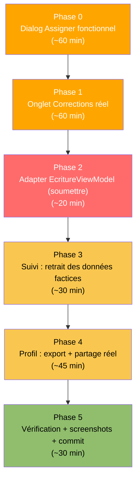

# EXEC-SPRINT3-FRONTEND-AGENT — Instructions Agent Codage Frontend

> **Rôle de ce fichier** : Instructions séquentielles pour l'agent de codage Android Studio chargé de la
> couche présentation (Compose UI, ViewModels) pour la continuation du Sprint 3.
> ⚠️ **Prérequis strict** : `EXEC-SPRINT3-BACKEND-AGENT.md` doit être entièrement terminé et mergé avant de
> démarrer ce fichier — toutes les phases ci-dessous dépendent des UseCases/DAO créés côté backend
> (`AssignerContenuUseCase`, `SoumettreProductionUseCase`, `GetProductionsSoumisesUseCase`, migration 4→5).
> Référence bugs : `docs/planification/RECONCILIATION-SPRINT3.md` (catalogue B-21 à B-27)

---

## Contexte de reprise

Build backend attendu : ✅ OK, version Room 5, `assemblerDebug` propre après merge de la branche backend.
Branche de travail : feature/C2-assignation-corrections-frontend

---

## Séquence globale



---

## Phase 0 — Dialog Assigner fonctionnel (correctif B-23)

### 0-A · Étendre `EnseignantUiState`

**Modifier** `app/src/main/java/edu/project/dlearn/presentation/enseignant/EnseignantUiState.kt` :

```kotlin
package edu.project.dlearn.presentation.enseignant

import edu.project.dlearn.domain.model.UniteApprentissage

data class EleveResume(
    val id: Long,
    val nomAffiche: String,
    val classe: String?,
    val niveauGer: String?,
    val unitesTerminees: Int,
    val scoreMoyen: Int
)

data class ProductionACorriger(
    val productionId: String,
    val eleveNom: String,
    val uniteTitre: String,
    val extrait: String,
    val dateModification: Long
)

data class EnseignantUiState(
    val enseignantId: Long = 0L,
    val enseignantNom: String = "",
    val eleves: List<EleveResume> = emptyList(),
    val unitesDisponibles: List<UniteApprentissage> = emptyList(),
    val productionsACorriger: List<ProductionACorriger> = emptyList(),
    val enChargement: Boolean = true,
    val ongletActif: OngletEnseignant = OngletEnseignant.CLASSE
)

enum class OngletEnseignant { CLASSE, CONTENUS, CORRECTIONS }
```

### 0-B · Étendre `EnseignantViewModel`

**Remplacer entièrement** `app/src/main/java/edu/project/dlearn/presentation/enseignant/EnseignantViewModel.kt` :

```kotlin
package edu.project.dlearn.presentation.enseignant

import androidx.lifecycle.ViewModel
import androidx.lifecycle.viewModelScope
import dagger.hilt.android.lifecycle.HiltViewModel
import edu.project.dlearn.domain.model.UniteApprentissage
import edu.project.dlearn.domain.usecase.AssignerContenuUseCase
import edu.project.dlearn.domain.usecase.GetAllUnitesUseCase
import edu.project.dlearn.domain.usecase.GetElevesUseCase
import edu.project.dlearn.domain.usecase.GetProductionsSoumisesUseCase
import edu.project.dlearn.domain.usecase.GetUtilisateurConnecteUseCase
import kotlinx.coroutines.flow.MutableStateFlow
import kotlinx.coroutines.flow.StateFlow
import kotlinx.coroutines.flow.asStateFlow
import kotlinx.coroutines.flow.combine
import kotlinx.coroutines.flow.first
import kotlinx.coroutines.flow.update
import kotlinx.coroutines.launch
import javax.inject.Inject

@HiltViewModel
class EnseignantViewModel @Inject constructor(
    private val getAllUnites: GetAllUnitesUseCase,
    private val getEleves: GetElevesUseCase,
    private val getUtilisateurConnecte: GetUtilisateurConnecteUseCase,
    private val assignerContenu: AssignerContenuUseCase,
    private val getProductionsSoumises: GetProductionsSoumisesUseCase
) : ViewModel() {

    private val _uiState = MutableStateFlow(EnseignantUiState())
    val uiState: StateFlow<EnseignantUiState> = _uiState.asStateFlow()

    /** Cache local des unités pour retrouver le titre lors de l'affichage des corrections. */
    private var unitesParId: Map<String, UniteApprentissage> = emptyMap()
    private var elevesParId: Map<Long, EleveResume> = emptyMap()

    init { charger() }

    private fun charger() {
        viewModelScope.launch {
            val enseignant = getUtilisateurConnecte()
            val unites = getAllUnites().first()
            unitesParId = unites.associateBy { it.id }

            combine(getEleves(), getProductionsSoumises()) { utilisateurs, productions ->
                val elevesResume = utilisateurs.map { u ->
                    EleveResume(
                        id = u.id, nomAffiche = u.nomAffiche, classe = u.classe, niveauGer = u.niveau,
                        unitesTerminees = 0, scoreMoyen = 0
                    )
                }
                elevesParId = elevesResume.associateBy { it.id }

                val productionsResume = productions.mapNotNull { p ->
                    val eleve = elevesParId[p.eleveId] ?: return@mapNotNull null
                    val unite = unitesParId[p.uniteId]
                    ProductionACorriger(
                        productionId     = p.id,
                        eleveNom         = eleve.nomAffiche,
                        uniteTitre       = unite?.titre ?: p.uniteId,
                        extrait          = p.contenuTexte.take(140) + if (p.contenuTexte.length > 140) "…" else "",
                        dateModification = p.dateModification
                    )
                }.sortedByDescending { it.dateModification }

                elevesResume to productionsResume
            }.collect { (elevesResume, productionsResume) ->
                _uiState.update { it.copy(
                    enseignantId       = enseignant?.id ?: 0L,
                    enseignantNom      = enseignant?.nomAffiche ?: "Enseignant",
                    unitesDisponibles  = unites,
                    eleves             = elevesResume,
                    productionsACorriger = productionsResume,
                    enChargement       = false
                )}
            }
        }
    }

    fun onChangerOnglet(onglet: OngletEnseignant) {
        _uiState.update { it.copy(ongletActif = onglet) }
    }

    /**
     * cibleType : "ELEVE" (cibleId = id élève en String) ou "CLASSE" (cibleId = nom de classe).
     * En mode ELEVE, appeler une fois par élève sélectionné.
     */
    fun onAssigner(uniteId: String, cibleType: String, cibleId: String) {
        viewModelScope.launch {
            val enseignantId = _uiState.value.enseignantId
            if (enseignantId == 0L) return@launch
            assignerContenu(enseignantId, cibleType, cibleId, uniteId)
        }
    }
}
```

> Note : `combine` sur deux `Flow` de collections + accès à `unitesParId` (état mutable local hors State)
> est acceptable ici car en lecture seule et recalculé à chaque émission — reste sur le thread de collecte du
> ViewModel (pas de accès concurrent UI). Si le lint du projet s'y oppose, déplacer `unitesParId` dans une
> `MutableStateFlow` interne combinée également.

### 0-C · Dialog d'assignation réel

**Modifier** `app/src/main/java/edu/project/dlearn/presentation/enseignant/EnseignantDashboardScreen.kt` —
remplacer la fonction `OngletContenus` et son usage :

```kotlin
@Composable
fun EnseignantDashboardScreen(
    onCreerEleve: () -> Unit = {},
    viewModel: EnseignantViewModel = hiltViewModel()
) {
    val etat by viewModel.uiState.collectAsState()

    if (etat.enChargement) {
        Box(Modifier.fillMaxSize(), contentAlignment = Alignment.Center) {
            CircularProgressIndicator()
        }
        return
    }

    Scaffold(
        floatingActionButton = {
            if (etat.ongletActif == OngletEnseignant.CLASSE) {
                FloatingActionButton(onClick = onCreerEleve) {
                    Icon(Icons.Filled.Add, contentDescription = "Créer un élève")
                }
            }
        }
    ) { padding ->
    Column(Modifier.fillMaxSize().padding(padding)) {
        Column(Modifier.padding(horizontal = 16.dp, vertical = 16.dp)) {
            Text("Bonjour, ${etat.enseignantNom}", style = MaterialTheme.typography.headlineMedium, fontWeight = FontWeight.Bold)
            Text("${etat.eleves.size} élève(s) dans votre classe", style = MaterialTheme.typography.bodyMedium, color = MaterialTheme.colorScheme.onSurfaceVariant)
        }

        TabRow(selectedTabIndex = etat.ongletActif.ordinal) {
            OngletEnseignant.entries.forEach { onglet ->
                Tab(
                    selected = etat.ongletActif == onglet,
                    onClick  = { viewModel.onChangerOnglet(onglet) },
                    text     = {
                        Text(
                            when (onglet) {
                                OngletEnseignant.CLASSE      -> "Classe"
                                OngletEnseignant.CONTENUS    -> "Contenus"
                                OngletEnseignant.CORRECTIONS -> "Corrections (${etat.productionsACorriger.size})"
                            }
                        )
                    }
                )
            }
        }

        when (etat.ongletActif) {
            OngletEnseignant.CLASSE      -> OngletClasse(etat.eleves)
            OngletEnseignant.CONTENUS    -> OngletContenus(
                unites  = etat.unitesDisponibles,
                eleves  = etat.eleves,
                onAssigner = viewModel::onAssigner
            )
            OngletEnseignant.CORRECTIONS -> OngletCorrections(etat.productionsACorriger)
        }
    }
    }
}

@Composable
private fun OngletContenus(
    unites: List<UniteApprentissage>,
    eleves: List<EleveResume>,
    onAssigner: (uniteId: String, cibleType: String, cibleId: String) -> Unit
) {
    var uniteAAssigner by remember { mutableStateOf<UniteApprentissage?>(null) }

    LazyColumn(
        contentPadding      = PaddingValues(16.dp),
        verticalArrangement = Arrangement.spacedBy(12.dp)
    ) {
        items(unites, key = { it.id }) { unite ->
            Card(Modifier.fillMaxWidth()) {
                Row(Modifier.padding(16.dp), verticalAlignment = Alignment.CenterVertically) {
                    Column(Modifier.weight(1f)) {
                        Text(unite.titre, style = MaterialTheme.typography.titleMedium, fontWeight = FontWeight.SemiBold)
                        Surface(shape = RoundedCornerShape(50), color = MaterialTheme.colorScheme.primaryContainer, modifier = Modifier.padding(top = 4.dp)) {
                            Text(unite.niveauGer, modifier = Modifier.padding(horizontal = 8.dp, vertical = 2.dp), style = MaterialTheme.typography.labelSmall, color = MaterialTheme.colorScheme.onPrimaryContainer)
                        }
                    }
                    OutlinedButton(onClick = { uniteAAssigner = unite }) {
                        Text("Assigner")
                    }
                }
            }
        }
    }

    uniteAAssigner?.let { unite ->
        DialogAssignation(
            unite    = unite,
            eleves   = eleves,
            onDismiss = { uniteAAssigner = null },
            onConfirmer = { cibleType, cibleIds ->
                cibleIds.forEach { id -> onAssigner(unite.id, cibleType, id) }
                uniteAAssigner = null
            }
        )
    }
}

@Composable
private fun DialogAssignation(
    unite: UniteApprentissage,
    eleves: List<EleveResume>,
    onDismiss: () -> Unit,
    onConfirmer: (cibleType: String, cibleIds: List<String>) -> Unit
) {
    var modeClasse by remember { mutableStateOf(true) }
    val classesDisponibles = remember(eleves) { eleves.mapNotNull { it.classe }.distinct() }
    var classeSelectionnee by remember(classesDisponibles) { mutableStateOf(classesDisponibles.firstOrNull()) }
    val elevesSelectionnes = remember { mutableStateListOf<Long>() }

    AlertDialog(
        onDismissRequest = onDismiss,
        title = { Text("Assigner « ${unite.titre} »") },
        text = {
            Column {
                SingleChoiceSegmentedButtonRow(modifier = Modifier.fillMaxWidth()) {
                    SegmentedButton(
                        selected = modeClasse, onClick = { modeClasse = true },
                        shape = SegmentedButtonDefaults.itemShape(0, 2)
                    ) { Text("Toute une classe") }
                    SegmentedButton(
                        selected = !modeClasse, onClick = { modeClasse = false },
                        shape = SegmentedButtonDefaults.itemShape(1, 2)
                    ) { Text("Élève(s)") }
                }

                Spacer(Modifier.height(16.dp))

                if (modeClasse) {
                    if (classesDisponibles.isEmpty()) {
                        Text(
                            "Aucune classe renseignée parmi les élèves enregistrés.",
                            color = MaterialTheme.colorScheme.onSurfaceVariant
                        )
                    } else {
                        classesDisponibles.forEach { classe ->
                            Row(
                                Modifier.fillMaxWidth().clickable { classeSelectionnee = classe },
                                verticalAlignment = Alignment.CenterVertically
                            ) {
                                RadioButton(selected = classeSelectionnee == classe, onClick = { classeSelectionnee = classe })
                                Text(classe)
                            }
                        }
                    }
                } else {
                    LazyColumn(modifier = Modifier.heightIn(max = 240.dp)) {
                        items(eleves, key = { it.id }) { eleve ->
                            Row(
                                Modifier.fillMaxWidth().clickable {
                                    if (elevesSelectionnes.contains(eleve.id)) elevesSelectionnes.remove(eleve.id)
                                    else elevesSelectionnes.add(eleve.id)
                                },
                                verticalAlignment = Alignment.CenterVertically
                            ) {
                                Checkbox(
                                    checked = elevesSelectionnes.contains(eleve.id),
                                    onCheckedChange = {
                                        if (it) elevesSelectionnes.add(eleve.id) else elevesSelectionnes.remove(eleve.id)
                                    }
                                )
                                Text("${eleve.nomAffiche}${eleve.classe?.let { " · $it" } ?: ""}")
                            }
                        }
                    }
                }
            }
        },
        confirmButton = {
            Button(
                enabled = if (modeClasse) classeSelectionnee != null else elevesSelectionnes.isNotEmpty(),
                onClick = {
                    if (modeClasse) {
                        classeSelectionnee?.let { onConfirmer("CLASSE", listOf(it)) }
                    } else {
                        onConfirmer("ELEVE", elevesSelectionnes.map { it.toString() })
                    }
                }
            ) { Text("Assigner") }
        },
        dismissButton = {
            TextButton(onClick = onDismiss) { Text("Annuler") }
        }
    )
}
```

**Imports à ajouter** en tête du fichier : `androidx.compose.foundation.clickable`,
`androidx.compose.foundation.lazy.items`, `androidx.compose.material3.Checkbox`,
`androidx.compose.material3.RadioButton`, `androidx.compose.material3.SegmentedButton`,
`androidx.compose.material3.SegmentedButtonDefaults`, `androidx.compose.material3.SingleChoiceSegmentedButtonRow`,
`androidx.compose.foundation.layout.heightIn`, `androidx.compose.runtime.mutableStateListOf`.

---

## Phase 1 — Onglet Corrections réel (correctif B-24)

**Modifier** `app/src/main/java/edu/project/dlearn/presentation/enseignant/EnseignantDashboardScreen.kt` —
remplacer `OngletCorrections` :

```kotlin
@Composable
private fun OngletCorrections(productions: List<ProductionACorriger>) {
    var productionOuverte by remember { mutableStateOf<ProductionACorriger?>(null) }

    if (productions.isEmpty()) {
        Box(Modifier.fillMaxSize(), contentAlignment = Alignment.Center) {
            Column(horizontalAlignment = Alignment.CenterHorizontally, modifier = Modifier.padding(32.dp)) {
                Icon(Icons.Filled.CloudOff, contentDescription = null, modifier = Modifier.size(56.dp), tint = MaterialTheme.colorScheme.onSurfaceVariant)
                Spacer(Modifier.height(16.dp))
                Text("Aucune production soumise pour le moment", style = MaterialTheme.typography.titleMedium, fontWeight = FontWeight.SemiBold, textAlign = TextAlign.Center)
                Spacer(Modifier.height(8.dp))
                Text(
                    "Les productions écrites soumises par les élèves apparaîtront ici automatiquement (même appareil) ou après un transfert local (Nearby Share, Bluetooth ou carte SD — Mission C3).",
                    style = MaterialTheme.typography.bodyMedium, color = MaterialTheme.colorScheme.onSurfaceVariant, textAlign = TextAlign.Center
                )
            }
        }
        return
    }

    LazyColumn(
        contentPadding      = PaddingValues(16.dp),
        verticalArrangement = Arrangement.spacedBy(12.dp)
    ) {
        items(productions, key = { it.productionId }) { production ->
            Card(
                Modifier.fillMaxWidth().clickable { productionOuverte = production }
            ) {
                Column(Modifier.padding(16.dp)) {
                    Row(
                        Modifier.fillMaxWidth(),
                        horizontalArrangement = Arrangement.SpaceBetween,
                        verticalAlignment = Alignment.CenterVertically
                    ) {
                        Text(production.eleveNom, style = MaterialTheme.typography.titleMedium, fontWeight = FontWeight.SemiBold)
                        Surface(shape = RoundedCornerShape(50), color = MaterialTheme.colorScheme.secondaryContainer) {
                            Text("Soumis", modifier = Modifier.padding(horizontal = 8.dp, vertical = 2.dp), style = MaterialTheme.typography.labelSmall, color = MaterialTheme.colorScheme.onSecondaryContainer)
                        }
                    }
                    Text(production.uniteTitre, style = MaterialTheme.typography.bodyMedium, color = MaterialTheme.colorScheme.primary)
                    Spacer(Modifier.height(6.dp))
                    Text(production.extrait, style = MaterialTheme.typography.bodySmall, color = MaterialTheme.colorScheme.onSurfaceVariant)
                }
            }
        }
    }

    productionOuverte?.let { production ->
        AlertDialog(
            onDismissRequest = { productionOuverte = null },
            title = { Text("${production.eleveNom} — ${production.uniteTitre}") },
            text = {
                Column(Modifier.heightIn(max = 400.dp).verticalScroll(rememberScrollState())) {
                    Text(production.extrait, style = MaterialTheme.typography.bodyMedium)
                }
            },
            confirmButton = {
                TextButton(onClick = { productionOuverte = null }) { Text("Fermer") }
            }
        )
    }
}
```

**Imports à ajouter** : `androidx.compose.foundation.rememberScrollState`,
`androidx.compose.foundation.verticalScroll`.

> Note : `production.extrait` est déjà tronqué à 140 caractères côté ViewModel (Phase 0). Pour Sprint 4, si
> le texte complet est nécessaire à la correction, ajouter un champ `contenuComplet` dans
> `ProductionACorriger` plutôt que de re-générer une requête dédiée ce sprint (garder le scope maîtrisé).

---

## Phase 2 — Adapter `EcritureViewModel` à la nouvelle signature de `soumettre()`

**Modifier** `app/src/main/java/edu/project/dlearn/presentation/ecriture/EcritureViewModel.kt` — remplacer
l'injection et `onSoumettre()` :

```kotlin
@HiltViewModel
class EcritureViewModel @Inject constructor(
    private val getAllUnites: GetAllUnitesUseCase,
    private val getOrCreateBrouillon: GetOrCreateBrouillonUseCase,
    private val sauvegarderBrouillon: SauvegarderBrouillonUseCase,
    private val soumettreProduction: edu.project.dlearn.domain.usecase.SoumettreProductionUseCase,
    private val getUtilisateurConnecte: GetUtilisateurConnecteUseCase
) : ViewModel() {

    // ... (inchangé jusqu'à onSoumettre) ...

    fun onSoumettre() {
        viewModelScope.launch {
            val etat = _uiState.value
            val production = etat.production ?: return@launch
            val ae = etat.autoEvaluation
            val json = """{"longueur":${ae.longueurRespectee},"coherence":${ae.coherenceAvecConsigne},"vocabulaire":${ae.vocabulaireNiveauGer}}"""
            soumettreProduction(production.id, etat.texteEnCours, json)
            _uiState.update { it.copy(soumis = true) }
        }
    }
}
```

Vérifier que le reste du fichier (chargement, `onTexteChange`, `onInserterCaractere`,
`onToggleAutoEvaluation`, `onAutoEvaluationChange`) reste inchangé — seule l'injection et `onSoumettre()`
changent.

---

## Phase 3 — Suivi : retrait des données factices (correctif partiel B-25)

**Modifier** `app/src/main/java/edu/project/dlearn/presentation/suivi/SuiviScreen.kt` :

1. Remplacer le `ProgressCard` "Progression globale" codé en dur :

```kotlin
item {
    val progressionReelle = stats.competencesParNiveau.values
        .let { if (it.isEmpty()) 0f else it.average().toFloat() }
    ProgressCard(
        title = "Progression globale",
        progress = progressionReelle,
        supportingText = "${stats.motsAppris} mots appris · basé sur ${stats.competencesParNiveau.size} niveau(x) suivi(s)"
    )
}
```

2. Remplacer le `StatItem` "Temps" (donnée non trackée, ne pas afficher une fausse valeur) :

```kotlin
StatItem(
    value = "—",
    label = "Temps",
    icon = Icons.Default.Timeline,
    modifier = Modifier.weight(1f)
)
```
Ajouter un commentaire au-dessus : `// TODO Sprint 4 (FR-23) : nécessite un suivi de durée de session, non implémenté — voir anomalie AN-F3-01`.

3. Retirer les deux `ActivityCard` d'historique factice ("Vocabulaire : La ville", "Lecture : Berlin") et
   les remplacer par un état vide honnête si aucune donnée réelle d'historique n'est disponible :

```kotlin
item {
    DlearnSectionHeader(title = "Historique récent")
}
item {
    EmptyStateCard(
        title = "Historique bientôt disponible",
        message = "Le détail de tes dernières activités sera affiché ici dans une prochaine mise à jour."
    )
}
```

4. Retirer le message d'encouragement chiffré arbitrairement ("Tu as progressé de 15% cette semaine") —
   remplacer par un message neutre sans pourcentage inventé :

```kotlin
item {
    EmptyStateCard(
        title = "Continue comme ça !",
        message = "Chaque exercice terminé te rapproche de ton objectif de niveau.",
        actionLabel = "Lancer un défi",
        onActionClick = { }
    )
}
```

---

## Phase 4 — Profil : export + partage réel (amorce Mission C3 côté UI)

**Modifier** `app/src/main/java/edu/project/dlearn/presentation/profil/ProfilViewModel.kt` :

```kotlin
@HiltViewModel
class ProfilViewModel @Inject constructor(
    private val authRepository: AuthRepository,
    private val getUtilisateurConnecte: GetUtilisateurConnecteUseCase,
    private val exportDataUseCase: edu.project.dlearn.domain.usecase.ExportDataUseCase
) : ViewModel() {

    // ... (état existant inchangé) ...

    private val _fichierExporte = MutableSharedFlow<String>()
    val fichierExporte: SharedFlow<String> = _fichierExporte

    fun onSynchroniserMaintenant() {
        if (_uiState.value.synchronisationEnCours) return
        viewModelScope.launch {
            _uiState.update { it.copy(synchronisationEnCours = true) }
            val utilisateur = getUtilisateurConnecte()
            val eleveId = utilisateur?.id ?: edu.project.dlearn.core.AppConstants.ELEVE_DEMO_ID
            val resultat = exportDataUseCase(eleveId)
            resultat.onSuccess { chemin -> _fichierExporte.emit(chemin) }
            _uiState.update { it.copy(
                synchronisationEnCours = false,
                derniereSynchro = if (resultat.isSuccess) "À l'instant" else "Échec — réessayer"
            )}
        }
    }
}
```

**Modifier** `app/src/main/java/edu/project/dlearn/presentation/profil/ProfilScreen.kt` — ajouter le
déclenchement du partage Android natif à la réception du fichier exporté :

```kotlin
val context = LocalContext.current

LaunchedEffect(Unit) {
    viewModel.fichierExporte.collect { chemin ->
        val fichier = java.io.File(chemin)
        val uri = androidx.core.content.FileProvider.getUriForFile(
            context, "${context.packageName}.fileprovider", fichier
        )
        val intent = android.content.Intent(android.content.Intent.ACTION_SEND).apply {
            type = "application/json"
            putExtra(android.content.Intent.EXTRA_STREAM, uri)
            addFlags(android.content.Intent.FLAG_GRANT_READ_URI_PERMISSION)
        }
        context.startActivity(android.content.Intent.createChooser(intent, "Partager mes données"))
    }
}
```

**Ajouter l'import** `androidx.compose.ui.platform.LocalContext` si absent.

### 4-A · Déclarer le FileProvider (obligatoire pour partager un fichier depuis `getExternalFilesDir`)

**Modifier** `app/src/main/AndroidManifest.xml` — ajouter dans `<application>` :

```xml
<provider
    android:name="androidx.core.content.FileProvider"
    android:authorities="${applicationId}.fileprovider"
    android:exported="false"
    android:grantUriPermissions="true">
    <meta-data
        android:name="android.support.FILE_PROVIDER_PATHS"
        android:resource="@xml/file_paths" />
</provider>
```

**Créer** `app/src/main/res/xml/file_paths.xml` :

```xml
<?xml version="1.0" encoding="utf-8"?>
<paths>
    <external-files-path name="exports" path="exports/" />
</paths>
```

> ⚠️ Vérifier que `androidx.core:core-ktx` (déjà présent dans `libs.versions.toml`) expose bien
> `FileProvider` — c'est le cas depuis `androidx.core`, aucune dépendance supplémentaire nécessaire.

---

## Phase 5 — Vérification, screenshots, commit

### 5-A · Build

```bash
./gradlew assembleDebug
./gradlew lintDebug
```

### 5-B · Vérification manuelle sur device (checklist)

| Scénario | Résultat attendu | ✓/✗ |
|---|---|---|
| Enseignant → Contenus → Assigner → "Toute une classe" | Dialog affiche les classes réellement présentes parmi les élèves | |
| Enseignant → Contenus → Assigner → "Élève(s)" → sélection multiple | Assignation créée par élève sélectionné (vérifier via logcat ou requête manuelle) | |
| Élève soumet une production dans Écriture | `etat.soumis = true` persiste après redémarrage de l'app | |
| Enseignant → Corrections | La production soumise apparaît avec le bon nom d'élève et titre d'unité | |
| Tap sur une carte Correction | Dialog affiche l'extrait du texte | |
| Suivi | Aucune valeur factice visible ("8h", "Berlin", "15%") | |
| Profil → Synchroniser maintenant | Feuille de partage Android s'ouvre avec un fichier `.json` | |
| Mode avion | Tout le scénario ci-dessus fonctionne hors ligne (le partage ouvre la feuille système sans réseau) | |

### 5-C · Screenshots

```bash
mkdir -p docs/screenshots/C2
mkdir -p docs/screenshots/C3
```
Archiver au moins : dialog d'assignation (mode classe + mode élève), onglet Corrections peuplé, feuille de
partage ouverte.

### 5-D · Documentation (obligatoire, procédure du dossier docs)

1. Compléter `docs/missions/C2-dashboard-enseignant-implementation.md` (créée côté backend) — cocher la
   Phase 2 frontend, passer le statut global à `Test`.
2. Compléter `docs/missions/C3-synchronisation-locale.md` — cocher l'export UI + partage (Phase 2 partielle :
   export fonctionnel, **import côté enseignant toujours à faire**, noter explicitement dans la fiche).
3. Créer une entrée `docs/journal/YYYY-MM-DD.md` (date réelle) résumant le travail frontend de cette session,
   reliée aux deux fiches ci-dessus.
4. Mettre à jour `docs/ETAT_ACTUEL.md` : cocher les items frontend de la section 3 (audit), mettre à jour la
   section 2 (missions actives) et la section 5 (fonctionnel).
5. Dans `04-missions-et-sprints.md`, cocher les items de DoD de Mission C2 concernant FR-26/FR-27 devenus
   fonctionnels de bout en bout.

### 5-E · Commit

```bash
git add -A
git commit -m "feat(frontend): dialog assignation fonctionnel, onglet corrections reel, suivi sans donnees factices, export/partage profil"
git push origin feature/C2-assignation-corrections-frontend
```

---

## Anomalies à documenter (ne pas traiter ce sprint)

| # | Description | Fichier | Priorité |
|---|---|---|---|
| AN-F3-01 | Le "Temps" d'étude affiché en Suivi n'a aucune source de données réelle (aucun suivi de durée de session en base) — nécessite une nouvelle table/mécanisme dédié | `SuiviScreen.kt` | Sprint 4+ (nouvelle FR à spécifier) |
| AN-F3-02 | Import du fichier exporté côté appareil enseignant non implémenté — seul l'export + partage fonctionnent | Mission C3 | Sprint 4 (suite C3) |
| AN-F3-03 | `ProductionACorriger.extrait` est tronqué à 140 caractères — pas de vue "texte complet" dédiée pour une vraie correction | `EnseignantDashboardScreen.kt` | Sprint 4 |
| AN-F3-04 | Le dialog d'assignation ne vérifie pas les doublons (assigner deux fois la même unité au même élève crée deux lignes) — sans conséquence fonctionnelle grave (l'élève verra juste l'assignation deux fois si câblée un jour côté Accueil, voir AN-B3-01) | `DialogAssignation` | Sprint 4 |

---

## DoD de cette session Frontend

- [ ] Dialog d'assignation fonctionnel (mode classe + mode élève multi-sélection), appelle réellement `AssignerContenuUseCase`
- [ ] Onglet Corrections affiche les vraies productions soumises (nom élève, titre unité, extrait)
- [ ] `EcritureViewModel.onSoumettre()` utilise `SoumettreProductionUseCase` — soumission persistée et vérifiée après redémarrage
- [ ] `SuiviScreen` ne contient plus aucune valeur factice non signalée comme telle
- [ ] `ProfilScreen` déclenche un partage Android réel du fichier d'export
- [ ] `FileProvider` déclaré et fonctionnel
- [ ] Build + lint propres
- [ ] Vérification manuelle sur device passée (table Phase 5-B)
- [ ] Screenshots archivés dans `docs/screenshots/C2/` et `docs/screenshots/C3/`
- [ ] Fiches de mission et journal mis à jour selon la procédure du dossier `docs/`
