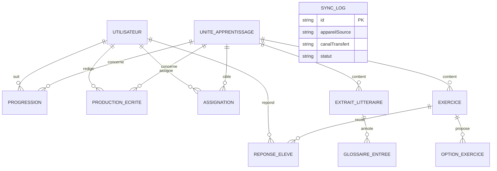

# Reconciliation Sprint 3 — Audit docs/code et décisions à formaliser

> Produit par The Architect le 2026-09-04. Ce document ne modifie aucun fichier existant : il liste les
> écarts trouvés entre la documentation (`docs/`) et l'état réel du code, et fournit le texte **prêt à
> coller** pour deux nouveaux ADR. Les agents de codage (EXEC-SPRINT3-BACKEND/FRONTEND) sont responsables
> d'intégrer effectivement ces textes dans `06-architecture-technique.md` et de cocher les cases
> correspondantes dans `04-missions-et-sprints.md`.

## 1. Méthode

Relecture intégrale du code source (`app/src/main/java/...`, `app/schemas/`, `app/src/main/assets/`) comparée
aux affirmations de `ETAT_ACTUEL.md` (2026-09-03), `06-architecture-technique.md`, `11-schema-donnees-room.md`
et `bugs-pre-sprint2.md`. Aucune hypothèse n'a été faite sans preuve dans le code : chaque écart ci-dessous est
sourcé par un fichier précis.

## 2. Ce qui est en avance sur la documentation (bonne nouvelle, à ne pas refaire)

| Élément | Preuve dans le code | État doc correspondant |
|---|---|---|
| `NavViewModel` câblé dans `LiteschreibApp()` | `NavGraph.kt` instancie `hiltViewModel<NavViewModel>()`, observe `destinationInitiale` et `utilisateurConnecte` | `ETAT_ACTUEL.md` (09-03) le donnait comme "à câbler" (B-05) |
| Module Exercice complet (QCM/texte à trous/vrai-faux) | `ExerciceEntity`, `ExerciceRepositoryImpl`, `ExerciceViewModel`, `ExerciceScreen`, route `exercices/{uniteId}` dans `MainScreen.kt` | Non mentionné dans le backlog Sprint 2, correspond en fait à une bonne partie de FR-12 (Mission B2) |
| Création de compte élève par l'enseignant | `CreerEleveUseCase`, `CreationEleveScreen`, `ResultatCreationEleveScreen`, route `creation_eleve` | Non documenté dans `04-missions-et-sprints.md` |
| `AppDatabase` v4 avec migration testée | `AppDatabase.MIGRATION_3_4` + `MigrationTest.kt` + `app/schemas/.../4.json` | ADR-015 documente la décision mais pas l'implémentation effective |
| `ConnexionScreen` sans bouton de création de compte élève | Absence du bouton dans le Composable, confirmé par `NavigationTest.ecran_connexion_ne_propose_plus_creation_compte_eleve` | Référence "B-20" trouvée dans les tests mais aucun catalogue de bugs Sprint 3 fourni dans `docs/` |

> Commentaires de code référençant `D-01` à `D-06`, `B-18`, `B-20` (ex. `NavViewModel.kt`, `Exercice.kt`,
> `AuthRepositoryImpl.kt`) indiquent qu'une session de travail a eu lieu **entre le rapport du 2026-09-03 et
> maintenant**, sans journal ni catalogue de bugs correspondant dans les documents fournis. Si un fichier
> `bugs-pre-sprint3.md` ou un journal plus récent existe dans le dépôt réel mais n'a pas été inclus dans cette
> session de travail, il doit être relu en priorité et réconcilié avec ce document.

## 3. Nouveaux gaps identifiés (catalogue B-21 à B-27)

| ID | Sévérité | Fichier(s) concerné(s) | Description | Impact |
|---|---|---|---|---|
| B-21 | 🔴 CRITIQUE | `EcritureRepositoryImpl.kt` | `soumettre(productionId, autoEvaluationJson)` est un corps vide avec commentaire `// TODO Sprint 3` | La soumission d'une production écrite (FR-15/FR-17) n'est **jamais persistée** ; `etat.soumis = true` dans `EcritureViewModel` ne survit pas à un redémarrage. Bloque directement B-24 (Corrections). |
| B-22 | 🟠 ÉLEVÉ | `AppDatabase.kt`, absence de `SyncLogDao.kt` | `SyncLogEntity` est déclarée dans `@Database(entities = [...])` et présente dans `schemas/4.json`, mais aucun DAO n'existe pour l'utiliser | La table existe en base mais est totalement inutilisée — aucune écriture de log de synchronisation possible |
| B-23 | 🟠 ÉLEVÉ | `EnseignantDashboardScreen.kt`, `OngletContenus` | Le bouton "Assigner à la classe" du dialog appelle un `TODO Sprint 3 : AssignerContenuUseCase` puis ferme simplement le dialog | FR-26 non fonctionnel malgré une UI complète |
| B-24 | 🟠 ÉLEVÉ | `EnseignantDashboardScreen.kt`, `OngletCorrections` | Placeholder statique ("disponible après synchronisation") sans aucune requête de données | FR-27 non fonctionnel ; dépend de B-21 pour avoir un statut fiable |
| B-25 | 🟡 MOYEN | `SuiviScreen.kt` | `progress = 0.65f` (commentaire "Placeholder"), `StatItem(value = "8h", ...)` codé en dur, historique récent (`ActivityCard`) avec données fictives ("Vocabulaire : La ville", "Lecture : Berlin") | FR-21/FR-23 affichent des données non représentatives — risque de confusion en démonstration/pilote |
| B-26 | 🟡 MOYEN | `11-schema-donnees-room.md` vs `AppDatabase.kt` | Le document décrit 14 entités (`ProfilEleve`, `ProfilEnseignant`, `Classe`, `Assignation`, `PlanificationRevision` séparées) ; le code réel en a 11, avec `UtilisateurEntity` unifiant élève/enseignant et un simple champ `classe: String?` | Aucun ADR ne couvre cette simplification — un lecteur du mémoire ou un nouvel agent se fierait à un schéma qui n'existe pas |
| B-27 | 🟡 MOYEN | `AppDatabase.kt`, `AppModule.kt` | `fallbackToDestructiveMigration()` actif avec un seul `TODO` inline comme unique garde-fou | Pas de politique explicite sur ce qui est acceptable ou non à partir de quelle version |

## 4. ADR-016 — Texte prêt à intégrer dans `06-architecture-technique.md`

> À insérer après ADR-015, et à ajouter à la table récapitulative de la section 6.

```markdown
### ADR-016 : Simplification du schéma de données — unification ProfilEleve/ProfilEnseignant
**Statut :** Accepted
**Date :** 2026-09-04 (formalisation rétroactive)

#### Contexte
Le schéma documenté dans `11-schema-donnees-room.md` (rédigé en amont du codage) prévoyait 4 entités de
profil distinctes : `ProfilEleve`, `ProfilEnseignant`, `Classe`, et une table `Assignation` reliant les deux
premières. Lors de l'implémentation réelle des Missions A4/A5, une simplification pragmatique a été adoptée
sans être consignée formellement : une entité unique `UtilisateurEntity` avec un champ `role` (`ELEVE` |
`ENSEIGNANT`) et un champ `classe: String?` en texte libre, sans table `Classe` relationnelle.

#### Décision
Formaliser rétroactivement cette simplification comme décision assumée pour le MVP (Cycle DBR 1). Le modèle
"utilisateur unique" est retenu :
- Une seule table `utilisateur`, discriminée par `role`.
- `classe` est un attribut texte libre sur l'élève (ex. "3ème"), pas une entité relationnelle.
- La relation enseignant → élèves n'est **pas** modélisée explicitement dans ce cycle : `EnseignantViewModel`
  affiche actuellement tous les élèves présents sur l'appareil (`getAllEleves()`), ce qui est cohérent avec un
  contexte pilote mono-enseignant/mono-classe par appareil.
- La table `Assignation` (voir ADR ci-après, ajoutée en Sprint 3) référence directement `enseignantId` et soit
  un `eleveId`, soit une chaîne `classe`, sans passer par une entité `Classe`.

#### Options considérées
- Implémenter le schéma complet à 14 entités tel que documenté initialement (rejeté : complexité relationnelle
  disproportionnée pour un pilote mono-enseignant, retarde les Missions B/C sans bénéfice pédagogique immédiat)
- Modèle simplifié `UtilisateurEntity` + attributs texte libres (retenu : réduit le nombre de jointures, aligné
  sur le contexte réel du pilote Yaoundé)

#### Conséquences
- **Limite explicite à documenter pour le mémoire** : ce modèle ne permet pas de cloisonner plusieurs
  enseignants suivant des classes différentes sur un même parc d'appareils partagés. Si le pilote s'étend à
  plusieurs enseignants/classes avant la fin du Cycle 1, cette limite devra être réévaluée (migration vers une
  entité `Classe` + relation explicite).
- `11-schema-donnees-room.md` doit être mis à jour pour refléter le schéma réel (11 entités) et déplacer
  `ProfilEleve`/`ProfilEnseignant`/`Classe` en section "modèle initialement envisagé, non retenu — voir
  ADR-016" plutôt que de les supprimer (traçabilité DBR).
- Risque à ajouter à `08-registre-des-risques.md` : absence de cloisonnement enseignant/classe en cas
  d'extension du pilote.
```

## 5. ADR-017 — Texte prêt à intégrer dans `06-architecture-technique.md`

```markdown
### ADR-017 : Politique de migration Room pré-pilote
**Statut :** Accepted
**Date :** 2026-09-04

#### Contexte
`AppDatabase` a connu deux incréments de version non documentés et non testés (implicitement 1→2 et 2→3,
couverts par `fallbackToDestructiveMigration()`) avant qu'une première migration réelle et testée (3→4) soit
introduite avec ADR-015. Le TODO inline dans `AppModule.kt`
(`// TODO(dette-technique): fallbackToDestructiveMigration() à remplacer par des migrations explicites avant
la Mission D0`) reste la seule trace de ce risque, sans politique explicite sur ce qui est acceptable.

#### Décision
1. `fallbackToDestructiveMigration()` reste actif comme filet de sécurité, mais son usage réel est **accepté
   sans regret uniquement pour les versions de schéma ≤ 4** : aucune donnée de pilote réelle n'a jamais existé
   sur un appareil hors développement à ces versions.
2. **À partir de la version 5 (introduite ce sprint, voir Assignation/statut Soumis), toute nouvelle version du
   schéma DOIT être accompagnée d'une `Migration` explicite testée via `MigrationTestHelper`**, sans exception.
   Un changement de schéma sans migration testée associée doit être refusé en revue de code.
3. Cette politique reste en vigueur jusqu'à Mission D0 (distribution pilote) et au-delà — elle n'est pas
   temporaire.

#### Options considérées
- Reconstruire rétroactivement les migrations 1→2 et 2→3 (rejeté : les schémas historiques exacts à ces
  versions n'ont jamais été exportés — `app/schemas/` ne contient que `3.json` et `4.json` — reconstruire à
  l'aveugle introduirait plus de risque que cela n'en résout)
- Accepter le passé, encadrer strictement l'avenir (retenu)

#### Conséquences
- Ajout d'un item à `05-checklist-quotidienne.md`, section "Checklist avant merge" : *"Si `AppDatabase.kt` est
  modifié (version bump), une `Migration` explicite et un test `MigrationTestHelper` associé sont présents"*.
- `14-charte-versionnage-contenu.md`, section 3 (tableau version Room ↔ application) doit être complété à
  chaque migration à partir de maintenant.
```

## 6. Schéma de données réel — vue à jour (à remplacer dans `11-schema-donnees-room.md` section 1)



*(`SYNC_LOG` reste isolée du reste du modèle métier — table technique, cohérent avec `11-schema-donnees-room.md` section 2.)*

## 7. Prochaines étapes

1. Un agent backend intègre le texte des sections 4 et 5 dans `06-architecture-technique.md` (Phase 0 de
   `EXEC-SPRINT3-BACKEND-AGENT.md`).
2. Le même agent met à jour `11-schema-donnees-room.md` (schéma réel + note de renvoi vers ADR-016).
3. Les bugs B-21 à B-27 sont traités selon la répartition indiquée dans `EXEC-SPRINT3-BACKEND-AGENT.md` et
   `EXEC-SPRINT3-FRONTEND-AGENT.md`.
4. `08-registre-des-risques.md` reçoit une nouvelle ligne pour le risque de cloisonnement enseignant/classe
   (voir ADR-016, conséquences).
