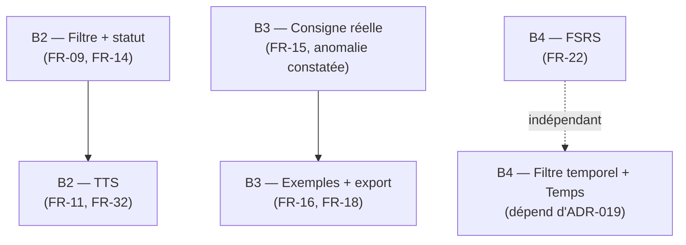

# Plan de tâches détaillé — Bloc B (Écrans fonctionnels élève)

## Objectif de ce document

Ce document décompose les Missions B2, B3 et B4 (`../04-missions-et-sprints.md`) en tâches réalisables en une session de travail, sur le modèle de `bloc-A-taches.md`. La Mission B1 n'apparaît pas ici : sa fiche (`../missions/B1-ecran-accueil.md`) porte déjà son propre découpage.

> ⚠️ **Base de ce plan** : relecture du code réel du dépôt (fourni le 2026-09-22), pas d'une planification abstraite. Une part substantielle de B2, B3 et B4 est déjà codée — ce document distingue précisément ce qui est fait de ce qui reste, plutôt que de repartir d'une feuille blanche. Voir les fiches `../missions/B2-ecran-apprentissage.md`, `B3-ecran-ecriture.md`, `B4-ecran-suivi.md` pour le détail narratif de chaque écart.

## Comment lire ce document

- **ID** unique (`B2-T01`, `B3-T05`…), repris dans les commits et les fiches de mission si besoin.
- **Dépend de** : tâches devant être terminées avant de démarrer celle-ci.
- **Statut** : ☐ À faire · 🔄 En cours · ✅ Fait *(déjà vérifié dans le code actuel)*
- **[BLOQUANT]** : tâche dont la non-réalisation empêche la mission suivante de démarrer sérieusement.

---

## 1. Vue d'ensemble

Les trois missions sont **indépendantes entre elles** ; aucune ne bloque les deux autres. À l'intérieur de chacune, l'ordre indiqué est recommandé mais pas strictement bloquant, sauf mention `[BLOQUANT]`.

---

## 2. Mission B2 — Écran Apprentissage

*(Contexte complet : `../missions/B2-ecran-apprentissage.md`)*

| ID | Tâche | Dépend de | Statut |
|---|---|---|---|
| B2-T01 | Bibliothèque des unités (liste, navigation vers la lecture) | — | ✅ Fait |
| B2-T02 | Lecture d'un extrait avec glossaire cliquable | T01 | ✅ Fait |
| B2-T03 | Affichage du niveau GeR et des objectifs en en-tête de lecture (FR-13) | T02 | ✅ Fait |
| B2-T04 | Module Exercice complet (QCM, texte à trous, vrai/faux, production guidée) | — | ✅ Fait |
| B2-T05 | Correction offline et enregistrement des réponses | T04 | ✅ Fait |
| B2-T06 | Marquer une unité « en cours » à l'ouverture (B-28) | T02 | ✅ Fait |
| B2-T07 | Marquer une unité « terminée » en fin d'exercices (B-28) | T04 | ✅ Fait |
| B2-T08 | Ajouter un filtre par niveau GeR dans la bibliothèque (réutiliser `GetUnitesParNiveauUseCase`) | T01 | ☐ À faire |
| B2-T09 | Afficher un badge de statut (non commencé/en cours/terminé) sur chaque carte d'unité | T06, T07 | ☐ À faire |
| B2-T10 | Créer `TtsManager` : vérification de la voix allemande installée | — | ☐ À faire |
| B2-T11 | **[BLOQUANT pour T12]** Écran/dialogue de proposition de téléchargement de la voix (FR-32), affiché une seule fois | T10 | ☐ À faire |
| B2-T12 | Lecture audio avec contrôle play/pause/vitesse (FR-11) | T11 | ☐ À faire |
| B2-T13 | Vérifier que l'usage du module reste strictement hors ligne une fois la voix installée (NFR-01-bis) | T12 | ☐ À faire |
| B2-T14 | Test d'instrumentation : parcours de lecture, glossaire | T02 | ☐ À faire |
| B2-T15 | Test d'instrumentation : scénario « voix non installée » et « voix installée » | T13 | ☐ À faire |
| B2-T16 | Mettre à jour `04-missions-et-sprints.md` (préciser l'état partiel FR-09/FR-14 avant de cocher B2) | T08, T09, T12 | ☐ À faire |

---

## 3. Mission B3 — Écran Écriture

*(Contexte complet : `../missions/B3-ecran-ecriture.md`)*

| ID | Tâche | Dépend de | Statut |
|---|---|---|---|
| B3-T01 | Éditeur de texte avec sauvegarde automatique (`debounce` 1500 ms) | — | ✅ Fait |
| B3-T02 | Clavier allemand dédié (ä, ö, ü, ß…) — FR-34 | — | ✅ Fait, jamais formalisé dans la DoD officielle |
| B3-T03 | Grille d'auto-évaluation (FR-17) | T01 | ✅ Fait |
| B3-T04 | Persistance réelle de la soumission (correctif B-21) | T01 | ✅ Fait |
| B3-T05 | Résolution de l'unité par argument de navigation ou niveau réel (correctif B-29) | — | ✅ Fait |
| B3-T06 | **[BLOQUANT pour T07]** Relier l'éditeur à l'exercice `PRODUCTION_GUIDEE` de l'unité comme consigne réelle, au lieu de `objectifsApprentissage` (anomalie constatée) | T05 | ☐ À faire |
| B3-T07 | Test d'instrumentation : la consigne affichée correspond à la vraie consigne d'écriture | T06 | ☐ À faire |
| B3-T08 | Ajouter des exemples de production modèles par niveau GeR, consultables hors ligne (FR-16) | — | ☐ À faire |
| B3-T09 | Ajouter un export/partage d'une production individuelle (FR-18), sur le modèle d'`ACTION_SEND` déjà utilisé pour la synchronisation | T04 | ☐ À faire |
| B3-T10 | Ajouter formellement FR-18 et FR-34 à la Definition of Done de B3 dans `04-missions-et-sprints.md` | T09 | ☐ À faire |
| B3-T11 | Attribuer un code d'anomalie (`AN-*`) à l'écart consigne/`PRODUCTION_GUIDEE` constaté (vérifier le prochain numéro libre après `AN-F3-04`) | — | ☐ À faire |

---

## 4. Mission B4 — Écran Suivi

*(Contexte complet : `../missions/B4-ecran-suivi.md`)*

| ID | Tâche | Dépend de | Statut |
|---|---|---|---|
| B4-T01 | Carte de progression globale avec données réelles (B-28) | — | ✅ Fait |
| B4-T02 | Streak réel (`calculerStreak`, tolérance d'un jour) | — | ✅ Fait |
| B4-T03 | Taux de réussite réel | — | ✅ Fait |
| B4-T04 | Placeholder honnête pour « Temps » (`"—"`, en attendant ADR-019) | — | ✅ Fait |
| B4-T05 | Test unitaire de `calculerStreak` (cas limites : aucune activité, hier, aujourd'hui) | T02 | ☐ À faire |
| B4-T06 | Câbler le filtre temporel (7j/30j/Tout), actuellement un `TODO` sans effet | — | ☐ À faire |
| B4-T07 | Concevoir l'algorithme de planification des révisions (FSRS simplifié) | — | ☐ À faire |
| B4-T08 | Intégrer une UI de révision espacée dans Suivi ou Apprentissage, à partir de `VocabEntity`/`ApprentissageDao.getFlashcardsDues` déjà existants | T07 | ☐ À faire |
| B4-T09 | Test unitaire de l'algorithme de planification | T07 | ☐ À faire |
| B4-T10 | **[Dépend d'ADR-019]** Remplacer le placeholder « Temps » par une vraie durée de session, une fois ADR-019 accepté et implémenté | ADR-019 | ☐ À faire |
| B4-T11 | Vérifier la cohérence des données entre Accueil, Apprentissage et Suivi | T01 à T04 | ☐ À faire |
| B4-T12 | Documenter le caractère heuristique de `competencesParNiveau` comme limite assumée si utilisé dans le mémoire | — | ☐ À faire |

---

## 5. Suivi

Ce document doit être mis à jour à chaque tâche terminée, en cohérence avec les fiches `../missions/B2-…`, `B3-…`, `B4-…` et avec `docs/ETAT_ACTUEL.md`. Il ne remplace pas le rapport journalier (`docs/journal/`), qui reste la trace narrative de chaque session.
