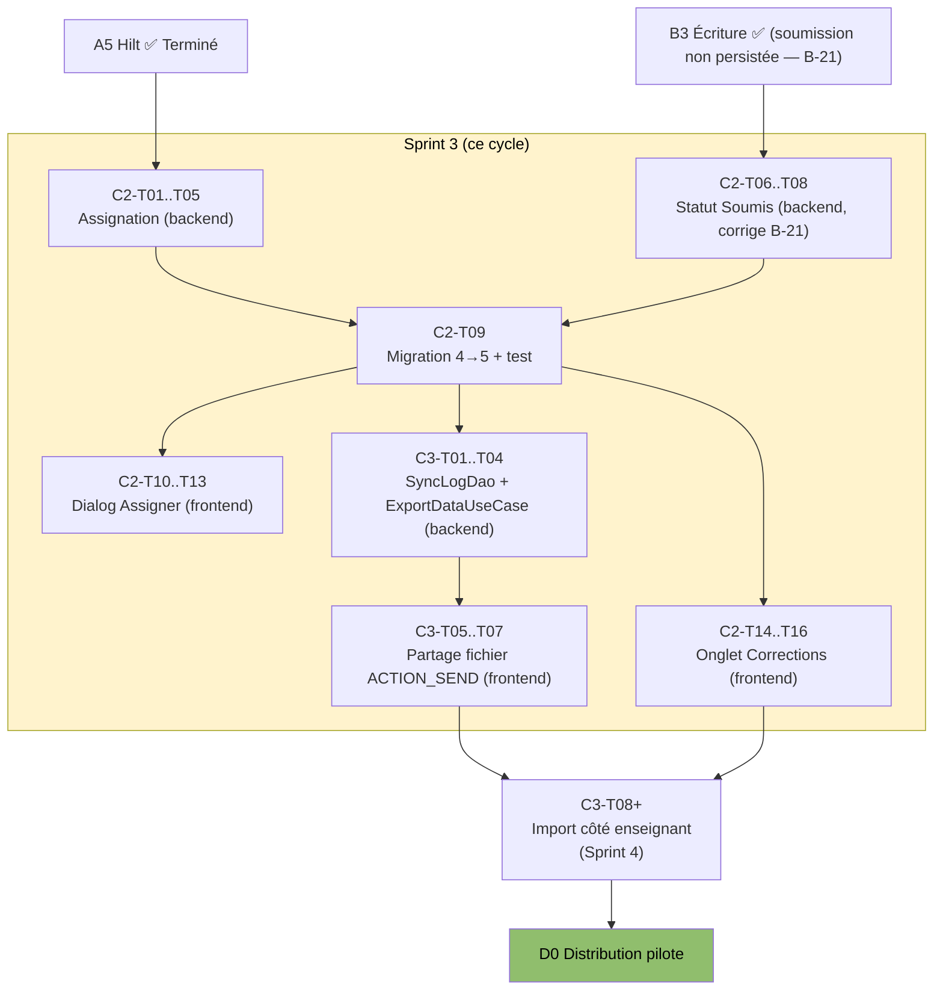
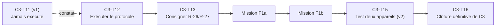

# Plan de tâches détaillé — Bloc C (Enseignant & synchronisation)

## Objectif de ce document

Décompose les Missions C2 (dashboard enseignant) et C3 (synchronisation locale) en tâches réalisables en une
session de travail, avec dépendances explicites — sur le modèle de `bloc-A-taches.md`. Produit par The
Architect le 2026-09-04, en même temps que `RECONCILIATION-SPRINT3.md` et les deux fichiers
`EXEC-SPRINT3-*-AGENT.md`.

> ⚠️ **Constat préalable** (voir `RECONCILIATION-SPRINT3.md` pour le détail) : au moment de la rédaction, la
> Mission C1 est `Validé` (supprimée par ADR-014), et la Mission C2 est en réalité **partiellement
> implémentée** (vue Classe fonctionnelle, Contenus et Corrections non fonctionnels — B-23, B-24), alors
> qu'aucune fiche `docs/missions/C2-*.md` n'existait encore. La Mission C3 n'a strictement aucun code avant ce
> sprint.

## Vue d'ensemble de l'enchaînement du Bloc C

---

## Mission C2 — Dashboard enseignant (implémentation complète)

*(Contexte : `docs/missions/C2-dashboard-enseignant-implementation.md`, à créer par l'agent backend — Phase 7 de `EXEC-SPRINT3-BACKEND-AGENT.md`)*

| ID | Tâche | Dépend de | Fichier(s) | Statut |
|---|---|---|---|---|
| C2-T01 | Créer `AssignationEntity` | — | `data/local/room/AssignationEntity.kt` | ☑ Fait |
| C2-T02 | Créer `AssignationDao` | T01 | `data/local/room/AssignationDao.kt` | ☑ Fait |
| C2-T03 | Créer modèle domaine `Assignation` + enum `CibleAssignation` | — | `domain/model/Assignation.kt` | ☑ Fait |
| C2-T04 | Créer `AssignationRepository` + impl | T01-T03 | `domain/repository/AssignationRepository.kt`, `data/repository/AssignationRepositoryImpl.kt` | ☑ Fait |
| C2-T05 | Créer `AssignerContenuUseCase` + `GetAssignationsPourEleveUseCase` + binding Hilt | T04 | `domain/usecase/AssignationUseCases.kt`, `AppModule.kt` | ☑ Fait |
| C2-T06 | **[BLOQUANT, corrige B-21]** Ajouter champ `statut` à `ProductionEcriteEntity` | — | `data/local/room/ProductionEcriteEntity.kt` | ☑ Fait |
| C2-T07 | Ajouter requêtes `getProductionsSoumises`/`marquerSoumise` au DAO | T06 | `data/local/room/ProductionEcriteDao.kt` | ☑ Fait |
| C2-T08 | Implémenter réellement `EcritureRepositoryImpl.soumettre()` | T06, T07 | `data/repository/EcritureRepositoryImpl.kt` | ☑ Fait |
| C2-T09 | **[BLOQUANT pour C2-T10+]** Migration Room 4→5 (assignation + statut) + test `MigrationTest` | T01, T06 | `AppDatabase.kt`, `MigrationTest.kt` | ☑ Fait |
| C2-T10 | Étendre `EnseignantUiState`/`EnseignantViewModel` (enseignantId, productionsACorriger, onAssigner) | T05, T07, C2-T09 | `EnseignantUiState.kt`, `EnseignantViewModel.kt` | ☑ Fait |
| C2-T11 | Implémenter `DialogAssignation` (mode Classe / mode Élève multi-sélection) | T10 | `EnseignantDashboardScreen.kt` | ☑ Fait |
| C2-T12 | Câbler `OngletContenus` au dialog réel | T11 | `EnseignantDashboardScreen.kt` | ☑ Fait |
| C2-T13 | Créer `GetProductionsSoumisesUseCase` | T07 | `domain/usecase/GetProductionsSoumisesUseCase.kt` | ☑ Fait |
| C2-T14 | Câbler `OngletCorrections` aux vraies données | T10, T13 | `EnseignantDashboardScreen.kt` | ☑ Fait |
| C2-T15 | Adapter `EcritureViewModel.onSoumettre()` à la nouvelle signature | T08, création `SoumettreProductionUseCase` | `EcritureViewModel.kt` | ☑ Fait |
| C2-T16 | Test manuel bout en bout (assigner + soumettre + corriger) sur device | T12, T14, T15 | — | ☑ Fait |
| C2-T17 | Mettre à jour `04-missions-et-sprints.md` (DoD Mission C2 cochée) + créer fiche `docs/missions/C2-*.md` | T16 | — | ☑ Fait |

## Mission C3 — Synchronisation locale (groundwork, ce sprint)

*(Contexte : `docs/missions/C3-synchronisation-locale.md`, à créer — portée **volontairement réduite** ce sprint à l'export + partage ; l'import reste Sprint 4+)*

| ID | Tâche | Dépend de | Fichier(s) | Statut |
|---|---|---|---|---|
| C3-T01 | **[BLOQUANT, corrige B-22]** Créer `SyncLogDao` | — (`SyncLogEntity` existe déjà) | `data/local/room/SyncLogDao.kt` | ☑ Fait |
| C3-T02 | Enregistrer `syncLogDao()` dans `AppDatabase` + Hilt | T01, C2-T09 | `AppDatabase.kt`, `AppModule.kt` | ☑ Fait |
| C3-T03 | Créer `SyncRepository` + impl (export JSON vers `getExternalFilesDir`) | T02 | `domain/repository/SyncRepository.kt`, `data/repository/SyncRepositoryImpl.kt` | ☑ Fait |
| C3-T04 | Créer `ExportDataUseCase` + binding Hilt | T03 | `domain/usecase/ExportDataUseCase.kt`, `AppModule.kt` | ☑ Fait |
| C3-T05 | Déclarer `FileProvider` + `file_paths.xml` | — | `AndroidManifest.xml`, `res/xml/file_paths.xml` | ☑ Fait |
| C3-T06 | Câbler `ProfilViewModel.onSynchroniserMaintenant()` à `ExportDataUseCase` | T04 | `ProfilViewModel.kt` | ☑ Fait |
| C3-T07 | Déclencher `Intent.ACTION_SEND` depuis `ProfilScreen` à réception du fichier exporté | T05, T06 | `ProfilScreen.kt` | ☑ Fait |
| C3-T08 | Test manuel : export + partage en mode avion, fichier JSON valide généré | T07 | — | ☑ Fait |
| C3-T09 | Documenter le format d'échange v1 dans `14-charte-versionnage-contenu.md` | T04 | `14-charte-versionnage-contenu.md` | ☑ Fait |
| C3-T10 | **[Reporté Sprint 4]** Écran d'import côté appareil enseignant (lecture du fichier, upsert Progression/ProductionEcrite) | T08 | *(à créer)* | ☐ Reporté |
| C3-T11 | **[Reporté Sprint 4]** Test bout en bout réel sur deux appareils physiques (FR-29, DoD Mission C3 complète) | T10 | — | ☐ Reporté |
| C3-T12 | Mettre à jour `04-missions-et-sprints.md` (Mission C3 : DoD partielle cochée, reste explicitement listé) | T09 | — | ☑ Fait |

---

## Suivi

Ce document doit être mis à jour à chaque tâche terminée (cocher `☑ Fait`), en cohérence avec les fiches
`docs/missions/C2-*.md` et `docs/missions/C3-*.md` et avec `docs/ETAT_ACTUEL.md`. Il ne remplace pas le
rapport journalier (`docs/journal/`), qui reste la trace narrative de chaque session.

**Prochaine planification à prévoir (Sprint 4)** : câblage `GetAssignationsPourEleveUseCase` dans
`AccueilScreen` (FR-08, anomalie AN-B3-01), import côté enseignant (C3-T10/T11), suivi de durée de session
pour clore B-25 complètement (anomalie AN-F3-01), et poursuite du seuil de contenu A0 (5 unités validées par
niveau — toujours 1/5 par niveau à ce stade, cf. `09-cartographie-contenu-pedagogique.md` section 5).

---

## 10. Complément 2026-09-22 — Test à deux appareils resté ouvert, et rework format v2

### Constat

La tâche **C3-T11** (« Test bout en bout réel sur deux appareils physiques ») a été marquée `☐ Reporté` lors du Sprint 3, avec la note « Reporté Sprint 4 ». Le journal du 2026-09-05 et les fiches de mission ne montrent aucune trace de son exécution en Sprint 4 non plus. `docs/missions/C3-synchronisation-locale.md` a été corrigée en conséquence le 2026-09-22.

### Nouvelles tâches

| ID | Tâche | Dépend de | Fichier(s) | Statut |
|---|---|---|---|---|
| C3-T12 | **[BLOQUANT pour la clôture de C3]** Exécuter `../TEST-PROTOCOLE-F1-DEUX-APPAREILS.md` sur le format v1 actuel, sans modification de code | — | `docs/planification/TEST-PROTOCOLE-F1-DEUX-APPAREILS.md` | ☐ À faire |
| C3-T13 | Consigner le résultat (R-26/R-27 confirmés ou non) dans `08-registre-des-risques.md` et dans un journal daté | C3-T12 | `docs/journal/`, `08-registre-des-risques.md` | ☐ À faire |
| C3-T14 | Corriger `EnseignantViewModel` pour signaler (et non plus écarter en silence) une production d'élève inconnu — *report anticipé, réalisé en pratique dans le cadre de F1b* | C3-T13, Mission F1b | `EnseignantViewModel.kt` | ☐ À faire (voir Mission F1b) |
| C3-T15 | Réexécuter le test à deux appareils avec le format v2 (bundles `STUDENT_REPORT`/`CLASS_PACKET`/`FEEDBACK`/`PROVISION`) | Mission F1b | `docs/missions/F1b-echange-v2-bundles.md` | ☐ À faire |
| C3-T16 | Clôturer définitivement la Mission C3 (Phase 4, DoD complète) | C3-T15 | `docs/missions/C3-synchronisation-locale.md` | ☐ À faire |

### Schéma de dépendance

Ce complément ne modifie aucune tâche C1/C2/C3-T01 à T10 déjà cochée ; il ajoute la suite manquante, désormais explicite plutôt qu'oubliée dans un report silencieux.
