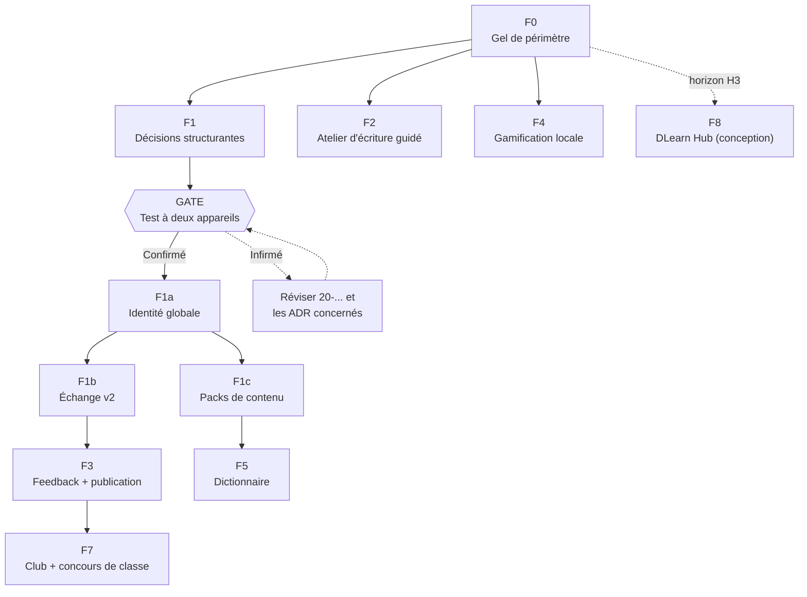

# Plan de tâches détaillé — Bloc F (Extension littéraire)

## Objectif de ce document

Ce document décompose les missions du Bloc F (`../04-missions-et-sprints.md`, voir aussi `../18-vision-produit-et-horizons.md`) en tâches réalisables en une session de travail, sur le modèle de `bloc-A-taches.md`. Contrairement au Bloc A, la majorité de ce bloc n'a **aucun code existant** : les tâches F0/F1/F1a/F1b/F1c couvrent l'intégration d'un travail déjà rédigé (ADR, spécifications) ; les tâches F2 et suivantes sont prospectives.

## Comment lire ce document

- **ID** unique (`F0-T01`, `F1a-T03`…).
- **Dépend de** : tâches devant être terminées avant de démarrer celle-ci.
- **Statut** : ☐ À faire · 🔄 En cours · ✅ Fait
- **[BLOQUANT]** : tâche dont la non-réalisation empêche la mission suivante de démarrer sérieusement.
- **[GATE]** : point de passage obligé où une décision humaine (pas seulement technique) est requise avant de continuer.

---

## 1. Vue d'ensemble

F2 et F4 peuvent démarrer dès F0 close, sans attendre F1/F1a/F1b/F1c.

---

## 2. Mission F0 — Gel de périmètre et gouvernance de la vision

*(Contexte complet : `../missions/F0-gel-perimetre-et-gouvernance.md`)*

| ID | Tâche | Dépend de | Statut |
|---|---|---|---|
| F0-T01 | Dédupliquer et classer les 12 capacités de la proposition | — | ✅ Fait |
| F0-T02 | Rédiger ADR-020 à ADR-025 | T01 | ✅ Fait |
| F0-T03 | Rédiger `18-vision-produit-et-horizons.md` | T02 | ✅ Fait |
| F0-T04 | Rédiger `19-registre-licences-contenus-tiers.md` | T02 | ✅ Fait |
| F0-T05 | Intégrer ADR-020 à ADR-025 dans `06-architecture-technique.md` | T02 | ☐ À faire |
| F0-T06 | Inscrire R-22 à R-27 dans `08-registre-des-risques.md` | T02 | ☐ À faire |
| F0-T07 | Inscrire FR-35 à FR-46 et NFR-30 à NFR-32 | T02 | ☐ À faire |
| F0-T08 | Créer le Bloc F dans `04-missions-et-sprints.md` | T02 | ☐ À faire |
| F0-T09 | Petits ajouts (`03-…`, `05-…`, `07-…`, `09-…`, `README.md`, `ETAT_ACTUEL.md`) | T02 | ☐ À faire |
| F0-T10 | Exécuter les vérifications `grep` de `INTEGRATION-DOCS-VISION.md` §8 | T05 à T09 | ☐ À faire |

---

## 3. Mission F1 — Décisions structurantes d'identité, de synchronisation et de packs

*(Contexte complet : `../missions/F1-identite-echange-packs.md`)*

| ID | Tâche | Dépend de | Statut |
|---|---|---|---|
| F1-T01 | Relire le code pour fonder les décisions sur des faits vérifiables | — | ✅ Fait |
| F1-T02 | Rédiger ADR-026, ADR-027, ADR-028 | T01 | ✅ Fait |
| F1-T03 | Rédiger `20-specification-formats-echange-et-packs.md` (enveloppe, types de bundles, manifeste des packs) | T02 | ✅ Fait |
| F1-T04 | Calculer et vérifier le vecteur de test (somme SHA-256) | T03 | ✅ Fait |
| F1-T05 | Présenter les décisions, options écartées et faits au porteur, obtenir validation | T02 | ✅ Fait |
| F1-T06 | Intégrer ADR-026 à ADR-028 dans `06-architecture-technique.md` (`INTEGRATION-DOCS-VISION-LOT2.md`) | T05 | ☐ À faire |
| F1-T07 | Mettre à jour R-26/R-27, ajouter R-28 à R-30 | T05 | ☐ À faire |
| F1-T08 | Mettre à jour FR-29/FR-31, ajouter FR-47, NFR-33 à NFR-35 | T05 | ☐ À faire |
| F1-T09 | Mettre à jour `11-…`, `14-…`, `10-…`, `12-…`, `13-…`, `18-…`, `03-…` | T05 | ☐ À faire |
| F1-T10 | **[GATE]** Exécuter `TEST-PROTOCOLE-F1-DEUX-APPAREILS.md` sur le code actuel (aucune modification) | T06 à T09 (peut être fait en parallèle) | ☐ À faire |
| F1-T11 | Consigner le verdict (R-26/R-27 confirmés, infirmés ou partiels) | T10 | ☐ À faire |
| F1-T12 | **[BLOQUANT pour F1a]** Si le verdict diffère des constats : réviser `20-…` et les ADR concernés avant d'ouvrir F1a | T11 | ☐ Conditionnel |

---

## 4. Mission F1a — Identité globale des utilisateurs

*(Contexte complet : `../missions/F1a-identite-globale-utilisateurs.md`)*

| ID | Tâche | Dépend de | Statut |
|---|---|---|---|
| F1a-T01 | Décider du regroupement ou non avec la migration Room 5→6 | F1-T11 | ☐ À faire |
| F1a-T02 | Migration : colonne `utilisateur.uid` (UUID v4), valeur par défaut pour les lignes existantes | T01 | ☐ À faire |
| F1a-T03 | Index unique sur `uid` et sur `identifiant` | T02 | ☐ À faire |
| F1a-T04 | Génération du `uid` à la création de compte (seed et `creerEleve`) | T02 | ☐ À faire |
| F1a-T05 | Gestion de la collision d'`identifiant` (nouvelle tentative) | T03 | ☐ À faire |
| F1a-T06 | `instanceId` : génération et persistance en DataStore | — | ☐ À faire |
| F1a-T07 | Remplacer `Build.MODEL` par `instanceId` dans `sync_log` | T06 | ☐ À faire |
| F1a-T08 | Conversion de `assignation.cibleId` (cible `ELEVE`) du `Long` vers le `uid` | T02 | ☐ À faire |
| F1a-T09 | **[BLOQUANT pour D0]** Isoler le `SeedCallback` de démonstration du build de release | — | ☐ À faire |
| F1a-T10 | Test de migration Room | T02, T03, T08 | ☐ À faire |
| F1a-T11 | Test d'installation à froid du build de release (aucun compte de démo) | T09 | ☐ À faire |
| F1a-T12 | Mettre à jour `11-…`, `14-…`, clore R-26 et R-28 dans `08-…` | T10, T11 | ☐ À faire |

---

## 5. Mission F1b — Échange v2 (bundles)

*(Contexte complet : `../missions/F1b-echange-v2-bundles.md`)*

| ID | Tâche | Dépend de | Statut |
|---|---|---|---|
| F1b-T01 | Mesurer et fixer le nombre d'itérations PBKDF2 sur les appareils de référence (ADR-012) | Mission F1a close | ☐ À faire |
| F1b-T02 | Migration : `progression.rev`, `production_ecrite.rev`, colonnes de hash étiqueté sur `utilisateur`, `sync_log.bundleId` | F1a close | ☐ À faire |
| F1b-T03 | Nouvelle table `commentaire` | T02 | ☐ À faire |
| F1b-T04 | Sérialiseur de l'enveloppe des bundles (forme canonique, somme de contrôle) | — | ☐ À faire |
| F1b-T05 | **[BLOQUANT pour T09]** Reproduire exactement le vecteur de test de `20-…` §6 dans un test unitaire | T04 | ☐ À faire |
| F1b-T06 | Émission des quatre types de bundles (`STUDENT_REPORT`, `PROVISION`, `FEEDBACK`, `CLASS_PACKET`) | T02, T03, T04 | ☐ À faire |
| F1b-T07 | Réception : ordre normatif (refus v1, somme de contrôle, rejeu, transaction unique, résumé) | T04 | ☐ À faire |
| F1b-T08 | Migration du hash SHA-256 existant vers PBKDF2 (rehash à la connexion) | T01, T02 | ☐ À faire |
| F1b-T09 | Statuts déduits (« commenté » via `commentaire.productionRev`) | T03, T07 | ☐ À faire |
| F1b-T10 | Mise à jour de l'UI de synchronisation (Profil, Dashboard enseignant) pour les nouveaux bundles | T06, T07 | ☐ À faire |
| F1b-T11 | Test : fichier tronqué, fichier rejoué, import interrompu | T07 | ☐ À faire |
| F1b-T12 | **[= C3-T15]** Test manuel à deux appareils, format v2, dans les deux sens | T10, T11 | ☐ À faire |
| F1b-T13 | **[= C3-T16]** Clôturer `docs/missions/C3-synchronisation-locale.md` | T12 | ☐ À faire |
| F1b-T14 | Mettre à jour `14-…` (rupture v1→v2 documentée), clore R-27 et R-30 dans `08-…` | T12 | ☐ À faire |

---

## 6. Mission F1c — Packs de contenu

*(Contexte complet : `../missions/F1c-packs-de-contenu.md`)*

| ID | Tâche | Dépend de | Statut |
|---|---|---|---|
| F1c-T01 | Migration : colonnes `revision`/`retire` sur les cinq tables de contenu | Mission F1a close | ☐ À faire |
| F1c-T02 | Nouvelle table `pack_installe` | F1a close | ☐ À faire |
| F1c-T03 | Importeur de pack unique (lecture ZIP, manifeste, somme de contrôle, upsert transactionnel) | T01, T02 | ☐ À faire |
| F1c-T04 | Migrer `ContentDataSource.peupler()` vers l'importeur unique (seed = pack `core`) | T03 | ☐ À faire |
| F1c-T05 | Écran « Crédits » alimenté par les manifestes | T03 | ☐ À faire |
| F1c-T06 | Interface d'installation d'un pack externe | T03 | ☐ À faire |
| F1c-T07 | Test : upsert (insertion, révision, retrait) | T01, T03 | ☐ À faire |
| F1c-T08 | Test : installation idempotente (même pack deux fois) | T03 | ☐ À faire |
| F1c-T09 | Test manuel : correction de contenu appliquée sans perte de progression (rejoue le scénario du bug B-09) | T04 | ☐ À faire |
| F1c-T10 | Mettre à jour `11-…`, `14-…`, clore R-29 dans `08-…` | T07 à T09 | ☐ À faire |

---

## 7. Missions F2 à F8 — Vue synthétique

Ces missions n'ont pas encore de code ; leurs fiches (`../missions/F2-…` à `F8-…`) portent chacune une Definition of Ready et une Definition of Done. Tâches à détailler à l'ouverture réelle de chaque mission, une fois ses prérequis satisfaits.

| Mission | Prérequis | Premier jalon à ouvrir |
|---|---|---|
| F2 — Atelier d'écriture guidé | F0 | Extension du gabarit `16-…` pour les fiches-méthode |
| F3 — Feedback et publication de classe | F1b | Modèle des statuts déduits (déjà spécifié, `20-…`) |
| F4 — Gamification locale | F0 | Fonction de calcul des badges (aucune nouvelle table) |
| F5 — Dictionnaire hors ligne | F1c, audit de licence | Choix de la source et de son statut dans `19-…` |
| F6 — Aides à l'écriture à règles | Mission E1, audit de licence | Interfaces de domaine (`SpellChecker`, `SynonymProvider`) |
| F7 — Club et concours de classe | F3 | Diffusion de questions/défis par `CLASS_PACKET` |
| F8 — DLearn Hub (conception) | Nouvel ADR supersédant ADR-002 | *(aucun code avant ce préalable)* |

---

## 8. Suivi

Ce document doit être mis à jour à chaque tâche terminée, en cohérence avec les fiches `../missions/F*.md` et avec `docs/ETAT_ACTUEL.md`. Il ne remplace pas le rapport journalier (`docs/journal/`).
