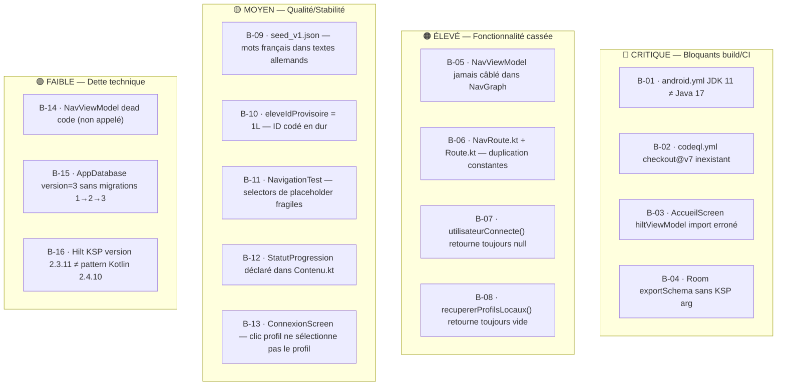

# Catalogue de bugs — Pré-Sprint 2

> Généré le 2026-09-03 par audit complet de la base de code post-Sprint-1.
> Tous les bugs doivent être résolus **avant** ou **pendant** Sprint 2,
> dans l'ordre de priorité indiqué. Référence croisée avec les fiches agents
> `EXEC-SPRINT2-BACKEND-AGENT.md` et `EXEC-SPRINT2-FRONTEND-AGENT.md`.

## Vue d'ensemble



---

## Détail par bug

### 🔴 B-01 — android.yml : JDK 11 incompatible avec Java 17
**Fichier :** `.github/workflows/android.yml`  
**Ligne :** `java-version: '11'`  
**Impact :** Échec systématique du pipeline CI `Android CI` sur push `main`.  
**Cause :** `app/build.gradle.kts` déclare `sourceCompatibility = JavaVersion.VERSION_17`.  
**Fix :** Changer `java-version: '11'` → `java-version: '17'`  
**Agent :** Backend  

---

### 🔴 B-02 — codeql.yml : action inexistante `actions/checkout@v7`
**Fichier :** `.github/workflows/codeql.yml`  
**Lignes :** `uses: actions/checkout@v7` (la dernière version stable est v4)  
**Impact :** Échec de l'analyse CodeQL sur chaque push/PR.  
**Fix :** `actions/checkout@v7` → `actions/checkout@v4`  
**Agent :** Backend  

---

### 🔴 B-03 — AccueilScreen.kt : import hiltViewModel incorrect
**Fichier :** `app/src/main/java/edu/project/dlearn/presentation/accueil/AccueilScreen.kt`  
**Ligne :** `import androidx.hilt.lifecycle.viewmodel.compose.hiltViewModel`  
**Impact :** Possible erreur de compilation (package `hilt.lifecycle.viewmodel.compose` n'existe pas dans `hilt-navigation-compose:1.4.0`).  
**Correct :** `import androidx.hilt.navigation.compose.hiltViewModel`  
**Note :** Tous les autres écrans utilisent le bon import. Risque de régression si le projet est nettoyé (clean build).  
**Agent :** Frontend  

---

### 🔴 B-04 — Room exportSchema sans répertoire KSP configuré
**Fichier :** `app/build.gradle.kts`  
**Problème :** `@Database(exportSchema = true)` dans `AppDatabase.kt` mais aucun argument KSP `room.schemaLocation` configuré.  
**Impact :** Warning de build, schéma non versionné, migrations non testables.  
**Fix :** Ajouter dans `app/build.gradle.kts` :
```kotlin
ksp {
    arg("room.schemaLocation", "$projectDir/schemas")
}
```
Créer le répertoire `app/schemas/` et l'ajouter au `.gitignore` (ou le versionner selon la politique de migration choisie).  
**Agent :** Backend  

---

### 🟠 B-05 — NavViewModel jamais câblé dans LiteschreibApp()
**Fichier :** `app/src/main/java/edu/project/dlearn/presentation/navigation/NavGraph.kt`  
**Problème :** `NavViewModel` existe et implémente la logique de routage intelligent (session → MAIN, multi-profil → SELECTION_PROFIL, vide → CONNEXION) mais n'est **jamais instancié** dans `LiteschreibApp()`. Le NavHost démarre toujours sur `Route.CONNEXION`.  
**Impact :** Routage intelligent non fonctionnel. Session persistée ignorée.  
**Dépend de :** B-07 résolu (DataStore session).  
**Fix :** Voir `EXEC-SPRINT2-FRONTEND-AGENT.md`, Phase 1.  
**Agent :** Frontend (après que Backend résout B-07)  

---

### 🟠 B-06 — Duplication des constantes de routes : NavRoute vs Route
**Fichiers :**
- `NavRoute.kt` : `object NavRoute { CONNEXION, SELECTION_PROFIL, POSITIONNEMENT, MAIN }`
- `Routes.kt` : `object Route { CONNEXION, SELECTION_PROFIL, POSITIONNEMENT, MAIN, CREATION_ELEVE, RESULTAT_CREATION_ELEVE }`

**Problème :** Deux objets avec des constantes identiques. `NavViewModel.kt` référence `NavRoute`, `NavGraph.kt` référence `Route`. Risque de divergence de valeurs à la prochaine modification.  
**Fix :** Supprimer `NavRoute.kt`, mettre à jour `NavViewModel.kt` pour importer `Route`.  
**Agent :** Backend  

---

### 🟠 B-07 — utilisateurConnecte() retourne toujours null
**Fichier :** `AuthRepositoryImpl.kt`  
```kotlin
override suspend fun utilisateurConnecte(): Utilisateur? = null // TODO
```
**Impact :** Aucune session n'est persistée entre deux lancements. L'utilisateur doit se reconnecter à chaque démarrage. `NavViewModel` route toujours vers CONNEXION.  
**Fix :** Implémenter `SessionManager` (DataStore) + mettre à jour `AuthRepositoryImpl`.  
**Agent :** Backend  

---

### 🟠 B-08 — recupererProfilsLocaux() retourne toujours une liste vide
**Fichier :** `AuthRepositoryImpl.kt`  
```kotlin
override suspend fun recupererProfilsLocaux(): List<Utilisateur> {
    return emptyList() // TODO
}
```
**Impact :** `NavViewModel.determinerDestination()` ne peut jamais atteindre les branches "profil unique → auto-connect" ou "multi-profil → SELECTION_PROFIL".  
**Fix :** Déléguer à `dao.recupererTous().map { it.toDomain() }`.  
**Agent :** Backend  

---

### 🟡 B-09 — seed_v1.json : mots français dans textes allemands
**Fichier :** `app/src/main/assets/content/seed_v1.json`  

| ID | Extrait erroné | Correction |
|---|---|---|
| EXT-6E-01-001 | `"Meine **famille est** groß"` | `"Meine **Familie ist** groß"` |
| EXT-4E-01-001 | `"Ich wasche mich **et** ziehe"` | `"Ich wasche mich **und** ziehe"` |
| EXT-3E-01-001 | `"Serge und seine **famille**"` | `"Serge und seine **Familie**"` |
| EXT-3E-01-002 (exercice) | `"seine **famille** ___ letzten Sommer"` | `"seine **Familie** ___ letzten Sommer"` |

**Impact :** Erreurs grammaticales dans le contenu pédagogique présenté aux élèves.  
**Agent :** Backend  

---

### 🟡 B-10 — eleveIdProvisoire = 1L codé en dur
**Fichiers :** `ApprentissageRepositoryImpl.kt`, `EcritureViewModel.kt`, `SuiviViewModel.kt`  
```kotlin
val eleveIdProvisoire = 1L
private const val ELEVE_ID_DEMO = 1L
```
**Risque :** Si la table `utilisateur` est réinitialisée ou si les seeds changent d'ordre, l'ID 1 ne correspond plus à l'élève de démo.  
**Fix court terme :** Constante partagée `AppConstants.ELEVE_DEMO_ID = 1L`  
**Fix long terme :** DataStore session (B-07) — le vrai `eleveId` viendra de la session.  
**Agent :** Backend  

---

### 🟡 B-11 — NavigationTest : selectors de placeholder fragiles
**Fichier :** `app/src/androidTest/java/edu/project/dlearn/navigation/NavigationTest.kt`  
```kotlin
composeRule.onNodeWithText("ex : eleve.2451").performTextInput("eleve.2451")
```
**Problème :** Le texte "ex : eleve.2451" est le `placeholder` du TextField. En Compose, `onNodeWithText` sur un placeholder peut échouer selon les versions ou si l'élément n'a pas le focus. Utiliser `onNodeWithTag` ou `onNodeWithContentDescription`.  
**Fix :** Ajouter des `testTag` sur les champs sensibles de `ConnexionScreen`.  
**Agent :** Frontend  

---

### 🟡 B-12 — StatutProgression déclaré dans Contenu.kt
**Fichier :** `domain/model/Contenu.kt`  
```kotlin
enum class StatutProgression { NON_COMMENCE, EN_COURS, TERMINE }
```
**Problème :** `ProgressionRepository.kt` importe `StatutProgression` depuis `domain.model` mais elle est cachée en fin de `Contenu.kt`. Confusion de responsabilités.  
**Fix :** Déplacer dans un fichier dédié `domain/model/StatutProgression.kt`.  
**Agent :** Backend  

---

### 🟡 B-13 — ConnexionScreen : clic sur profil existant ne sélectionne pas ce profil
**Fichier :** `ConnexionScreen.kt`  
```kotlin
etat.profilsExistants.take(3).forEach { profil ->
    OutlinedButton(
        onClick = viewModel::onVoirProfilsExistants, // même handler pour tous !
```
**Problème :** Cliquer sur le profil "Aïcha" navigue vers `SelectionProfilScreen` sans pré-sélectionner ce profil. UX incohérente.  
**Fix :** Passer `profil` à un handler dédié qui tente une connexion directe (si pas de PIN requis).  
**Agent :** Frontend  

---

### 🟢 B-14 — NavViewModel : dead code (non utilisé avant fix B-05)
**Statut :** Acceptable jusqu'à résolution de B-05. Voir `EXEC-SPRINT2-FRONTEND-AGENT.md`.

### 🟢 B-15 — AppDatabase version=3 sans migrations explicites 1→2→3
**Statut :** Dette technique documentée (TODO dans `AppDatabase.kt`). Bloquant avant Mission D0, pas avant.

### 🟢 B-16 — Hilt KSP version 2.3.11 vs Kotlin 2.4.10
**Statut :** Build fonctionnel. À vérifier si mise à jour KSP est nécessaire lors du prochain update Kotlin.

---

## Matrice de résolution

| Bug | Agent | Phase | Dépend de | Sprint |
|---|---|---|---|---|
| B-01 | Backend | 0 | — | 2 |
| B-02 | Backend | 0 | — | 2 |
| B-03 | Frontend | 0 | — | 2 |
| B-04 | Backend | 0 | — | 2 |
| B-05 | Frontend | 1 | B-07 résolu | 2 |
| B-06 | Backend | 0 | — | 2 |
| B-07 | Backend | 1 | — | 2 |
| B-08 | Backend | 1 | — | 2 |
| B-09 | Backend | 0 | — | 2 |
| B-10 | Backend | 2 | — | 2 |
| B-11 | Frontend | 2 | — | 2 |
| B-12 | Backend | 2 | — | 2 |
| B-13 | Frontend | 2 | B-05 | 2 |
| B-14 | — | — | B-05 | — |
| B-15 | Backend | D0 | — | avant pilote |
| B-16 | Backend | monitoring | — | optionnel |
